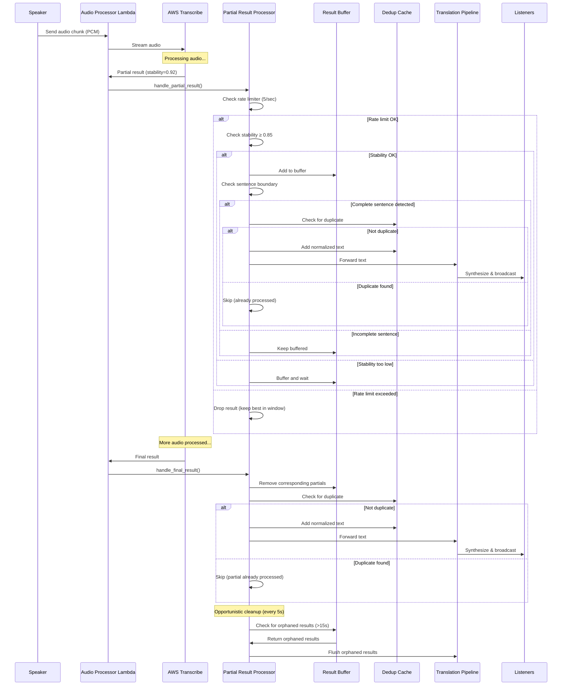
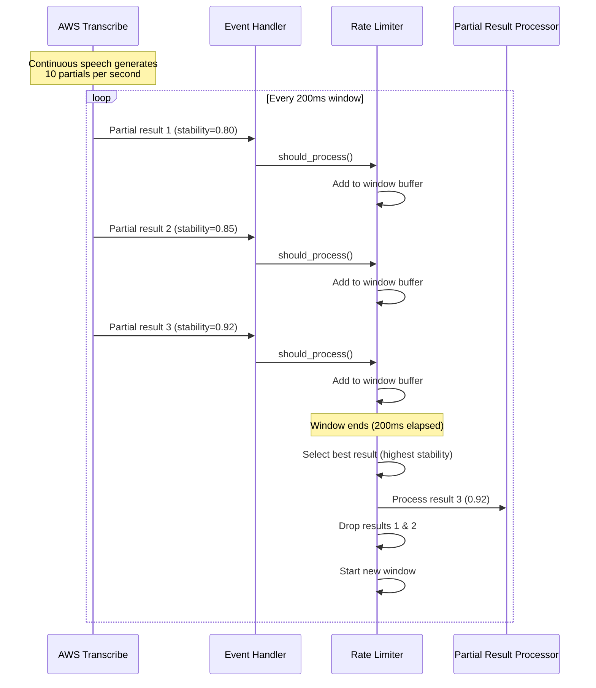
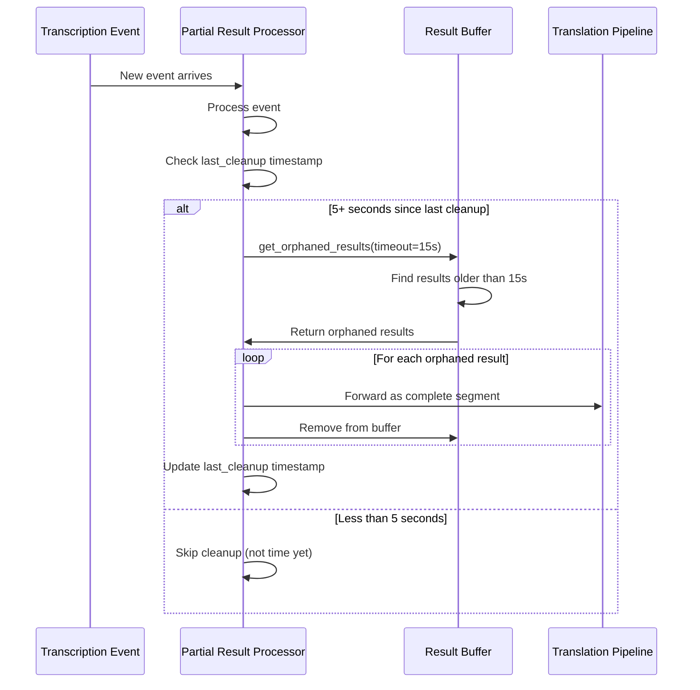

# Design Document

## Overview

This design document describes the architecture and implementation approach for real-time audio transcription with partial results processing. The feature extends the existing audio processing pipeline to handle intermediate transcription results from AWS Transcribe, enabling reduced latency while maintaining translation quality through intelligent buffering, stability-based filtering, and deduplication mechanisms.

### Design Goals

1. **Minimize Latency**: Reduce end-to-end latency from 3-7 seconds to 2-4 seconds by processing partial results
2. **Maintain Quality**: Achieve ≥90% translation accuracy compared to final-result-only processing
3. **Control Costs**: Limit partial result processing to 5 per second to prevent excessive AWS service calls
4. **Ensure Robustness**: Handle edge cases including missing stability scores, out-of-order results, and orphaned partials
5. **Enable Configurability**: Support per-session configuration of stability thresholds and buffer timeouts

### Key Design Decisions

**Decision 1: Stability-Based Forwarding**
- Forward partial results only when stability score ≥ 0.85 (configurable)
- Rationale: Balances latency reduction with accuracy preservation
- Trade-off: Some languages may not provide stability scores (fallback to 3-second timeout)

**Decision 2: Rate Limiting at 5 Partials/Second**
- Process maximum 5 partial results per second per session
- Rationale: Prevents cost explosion during continuous speech (AWS Transcribe can emit 10+ partials/second)
- Implementation: 200ms sliding window, keep most recent + highest stability

**Decision 3: Text Normalization for Deduplication**
- Normalize to lowercase and remove punctuation before cache comparison
- Rationale: Partial results often differ from finals only in capitalization/punctuation
- Example: "hello everyone" (partial) matches "Hello everyone." (final)


## Architecture

### System Context

The partial results processing feature integrates into the existing audio processing pipeline between the Transcription Service (AWS Transcribe) and the Translation Pipeline. It acts as an intelligent filter and buffer that decides when to forward transcription results based on stability, timing, and quality criteria.

```
┌─────────────────────────────────────────────────────────────────┐
│                    EXISTING PIPELINE                            │
│                                                                 │
│  Speaker Audio → Emotion Detection → AWS Transcribe            │
│                                          ↓                      │
│                                    [NEW COMPONENT]              │
│                                  Partial Result                 │
│                                     Processor                   │
│                                          ↓                      │
│                                  Translation Pipeline           │
│                                          ↓                      │
│                                  Synthesis Pipeline             │
│                                          ↓                      │
│                                    Listeners                    │
└─────────────────────────────────────────────────────────────────┘
```

### Component Architecture

```
┌──────────────────────────────────────────────────────────────────┐
│              PARTIAL RESULT PROCESSOR COMPONENT                  │
├──────────────────────────────────────────────────────────────────┤
│                                                                  │
│  ┌────────────────────────────────────────────────────────┐    │
│  │  1. Transcription Event Handler                       │    │
│  │     - Receives events from AWS Transcribe stream       │    │
│  │     - Extracts IsPartial flag, stability score, text   │    │
│  │     - Routes to partial or final handler               │    │
│  └────────────┬───────────────────────────────────────────┘    │
│               │                                                 │
│               ├──────────────┬──────────────────────────────┐   │
│               ▼              ▼                              │   │
│  ┌─────────────────────┐ ┌──────────────────────────────┐  │   │
│  │ 2a. Partial Result  │ │ 2b. Final Result Handler     │  │   │
│  │     Handler         │ │     - Replaces partials      │  │   │
│  │  - Rate limiter     │ │     - Clears buffer          │  │   │
│  │  - Stability check  │ │     - Forwards to translation│  │   │
│  │  - Buffer/forward   │ │     - Updates dedup cache    │  │   │
│  └──────────┬──────────┘ └──────────┬───────────────────┘  │   │
│             │                       │                       │   │
│             └───────────┬───────────┘                       │   │
│                         ▼                                   │   │
│  ┌────────────────────────────────────────────────────────┐│   │
│  │  3. Result Buffer                                      ││   │
│  │     - Stores partial results awaiting finalization    ││   │
│  │     - Tracks timestamps and stability scores          ││   │
│  │     - Implements orphan timeout (15 seconds)          ││   │
│  │     - Maximum capacity: 10 seconds of text            ││   │
│  └────────────┬───────────────────────────────────────────┘│   │
│               │                                             │   │
│               ▼                                             │   │
│  ┌────────────────────────────────────────────────────────┐│   │
│  │  4. Deduplication Cache                                ││   │
│  │     - Stores normalized text hashes                    ││   │
│  │     - TTL: 10 seconds                                  ││   │
│  │     - Prevents duplicate synthesis                     ││   │
│  └────────────┬───────────────────────────────────────────┘│   │
│               │                                             │   │
│               ▼                                             │   │
│  ┌────────────────────────────────────────────────────────┐│   │
│  │  5. Sentence Boundary Detector                         ││   │
│  │     - Detects punctuation (. ? !)                      ││   │
│  │     - Monitors pause duration                          ││   │
│  │     - Implements buffer timeout (5 seconds)            ││   │
│  └────────────┬───────────────────────────────────────────┘│   │
│               │                                             │   │
│               ▼                                             │   │
│  ┌────────────────────────────────────────────────────────┐│   │
│  │  6. Translation Forwarder                              ││   │
│  │     - Normalizes text for deduplication                ││   │
│  │     - Checks dedup cache                               ││   │
│  │     - Forwards to translation pipeline                 ││   │
│  │     - Updates cache                                    ││   │
│  └────────────────────────────────────────────────────────┘│   │
│                                                              │   │
└──────────────────────────────────────────────────────────────────┘
```


## Components and Interfaces

### 1. Transcription Event Handler

**Responsibility**: Receive and parse transcription events from AWS Transcribe Streaming API

**Interface**:
```python
class TranscriptionEventHandler:
    def handle_event(self, event: dict) -> None:
        """
        Process transcription event from AWS Transcribe.
        
        Args:
            event: Transcribe event containing transcript results
        """
        
    def _extract_result_metadata(self, event: dict) -> ResultMetadata:
        """
        Extract metadata from transcription event.
        
        Returns:
            ResultMetadata with is_partial, stability, text, timestamp
        """
```

**Key Attributes**:
- `is_partial`: Boolean flag from event (IsPartial field)
- `stability_score`: Float 0.0-1.0 (may be None for some languages)
- `text`: Transcribed text string
- `result_id`: Unique identifier for this result
- `timestamp`: Event timestamp for ordering

**Routing Logic**:
```python
if event.is_partial:
    partial_result_handler.process(event)
else:
    final_result_handler.process(event)
```

### 2a. Partial Result Handler

**Responsibility**: Process partial results with rate limiting and stability filtering

**Interface**:
```python
class PartialResultHandler:
    def __init__(self, config: PartialResultConfig):
        self.rate_limiter = RateLimiter(max_rate=5)  # 5 per second
        self.min_stability = config.min_stability_threshold
        self.result_buffer = ResultBuffer()
        
    def process(self, result: PartialResult) -> None:
        """
        Process partial transcription result.
        
        Args:
            result: Partial result with text, stability, timestamp
        """
        
    def _should_forward(self, result: PartialResult) -> bool:
        """
        Determine if partial result should be forwarded.
        
        Returns:
            True if stability >= threshold and rate limit allows
        """
```

**Processing Flow**:
1. Check rate limiter (5 per second limit)
2. If rate limited: Keep only highest stability result in 200ms window
3. Check stability score ≥ configured threshold (default 0.85)
4. If stability unavailable: Use 3-second buffer timeout
5. Add to result buffer
6. Check sentence boundary detector
7. If complete sentence detected: Forward to translation

### 2b. Final Result Handler

**Responsibility**: Process final results and clean up partial results

**Interface**:
```python
class FinalResultHandler:
    def __init__(self, result_buffer: ResultBuffer, dedup_cache: DeduplicationCache):
        self.result_buffer = result_buffer
        self.dedup_cache = dedup_cache
        
    def process(self, result: FinalResult) -> None:
        """
        Process final transcription result.
        
        Args:
            result: Final result with text, timestamp
        """
        
    def _remove_corresponding_partials(self, result: FinalResult) -> List[PartialResult]:
        """
        Remove partial results that correspond to this final result.
        
        Returns:
            List of removed partial results for logging/analysis
        """
```

**Processing Flow**:
1. Remove corresponding partial results from buffer (match by result_id or timestamp range)
2. Check deduplication cache to avoid re-processing
3. Forward to translation pipeline
4. Update deduplication cache with normalized text
5. Log discrepancies if final differs significantly from forwarded partial (>20% difference)

### 3. Result Buffer

**Responsibility**: Store partial results awaiting finalization or timeout

**Interface**:
```python
class ResultBuffer:
    def __init__(self, max_capacity_seconds: int = 10):
        self.buffer: Dict[str, BufferedResult] = {}
        self.max_capacity_seconds = max_capacity_seconds
        
    def add(self, result: PartialResult) -> None:
        """Add partial result to buffer."""
        
    def remove_by_id(self, result_id: str) -> Optional[PartialResult]:
        """Remove specific result from buffer."""
        
    def get_orphaned_results(self, timeout_seconds: int = 15) -> List[PartialResult]:
        """Get results older than timeout without final result."""
        
    def flush_oldest(self) -> List[PartialResult]:
        """Flush oldest results when capacity exceeded."""
```

**Data Structure**:
```python
@dataclass
class BufferedResult:
    result_id: str
    text: str
    stability_score: Optional[float]
    timestamp: float
    added_at: float
    forwarded: bool  # Track if already forwarded to translation
```

**Capacity Management**:
- Maximum 10 seconds of transcribed text
- Estimate: ~30 words per second × 10 seconds = 300 words max
- Flush oldest stable results when capacity exceeded

**Orphan Cleanup**:
- Opportunistic cleanup runs on each event processing (not as separate background task)
- Checks every 5 seconds (tracked via last_cleanup timestamp)
- Identifies results older than 15 seconds without corresponding final
- Flushes orphaned results as complete segments

**Implementation Note**: Lambda is event-driven, so cleanup runs opportunistically during event processing rather than as a continuous background task:
```python
class PartialResultProcessor:
    def __init__(self):
        self.last_cleanup = time.time()
    
    def process_event(self, event):
        # Process the event
        self._handle_event(event)
        
        # Opportunistic cleanup every 5 seconds
        if time.time() - self.last_cleanup >= 5.0:
            self._cleanup_orphans()
            self.last_cleanup = time.time()
```


### 4. Deduplication Cache

**Responsibility**: Prevent duplicate synthesis of identical text segments

**Interface**:
```python
class DeduplicationCache:
    def __init__(self, ttl_seconds: int = 10):
        self.cache: Dict[str, CacheEntry] = {}
        self.ttl_seconds = ttl_seconds
        
    def contains(self, text: str) -> bool:
        """Check if normalized text exists in cache."""
        
    def add(self, text: str) -> None:
        """Add normalized text to cache with TTL."""
        
    def normalize_text(self, text: str) -> str:
        """
        Normalize text for comparison.
        
        Normalization:
        - Convert to lowercase
        - Remove punctuation (. , ! ? ; :)
        - Strip whitespace
        - Remove multiple spaces
        
        Example:
            "Hello everyone, this is important!" 
            → "hello everyone this is important"
        """
```

**Cache Implementation**:
- In-memory dictionary with TTL
- Key: Normalized text hash (SHA-256 for efficiency)
- Value: Timestamp of addition
- Background cleanup every 30 seconds removes expired entries

**Normalization Algorithm**:
```python
import re
import hashlib

def normalize_text(text: str) -> str:
    # Convert to lowercase
    text = text.lower()
    
    # Remove punctuation
    text = re.sub(r'[.,!?;:\'\"]', '', text)
    
    # Remove multiple spaces
    text = re.sub(r'\s+', ' ', text)
    
    # Strip whitespace
    text = text.strip()
    
    return text

def hash_text(text: str) -> str:
    normalized = normalize_text(text)
    return hashlib.sha256(normalized.encode()).hexdigest()
```

### 5. Sentence Boundary Detector

**Responsibility**: Determine when partial results form complete sentences

**Interface**:
```python
class SentenceBoundaryDetector:
    def __init__(self, pause_threshold_seconds: float = 2.0, buffer_timeout_seconds: float = 5.0):
        self.pause_threshold = pause_threshold_seconds
        self.buffer_timeout = buffer_timeout_seconds
        self.last_result_time: Optional[float] = None
        
    def is_complete_sentence(self, result: PartialResult, is_final: bool) -> bool:
        """
        Determine if result represents a complete sentence.
        
        Returns:
            True if sentence is complete and should be forwarded
        """
        
    def _has_sentence_ending_punctuation(self, text: str) -> bool:
        """Check if text ends with . ? !"""
        
    def _pause_detected(self, current_time: float) -> bool:
        """Check if pause exceeds threshold since last result."""
```

**Detection Algorithm**:
```python
def is_complete_sentence(self, result: PartialResult, is_final: bool) -> bool:
    # Condition 1: Final result (always complete)
    if is_final:
        return True
    
    # Condition 2: Ends with sentence punctuation
    if self._has_sentence_ending_punctuation(result.text):
        return True
    
    # Condition 3: Pause detected (2+ seconds since last result)
    current_time = time.time()
    if self.last_result_time and (current_time - self.last_result_time) >= self.pause_threshold:
        return True
    
    # Condition 4: Buffer timeout (5 seconds since first buffered result)
    if result.added_at and (current_time - result.added_at) >= self.buffer_timeout:
        return True
    
    return False
```

### 6. Translation Forwarder

**Responsibility**: Forward processed results to translation pipeline with deduplication

**Interface**:
```python
class TranslationForwarder:
    def __init__(self, dedup_cache: DeduplicationCache, translation_pipeline: TranslationPipeline):
        self.dedup_cache = dedup_cache
        self.translation_pipeline = translation_pipeline
        
    def forward(self, text: str, session_id: str, source_language: str) -> bool:
        """
        Forward text to translation pipeline if not duplicate.
        
        Returns:
            True if forwarded, False if duplicate (skipped)
        """
        
    def _should_skip_duplicate(self, text: str) -> bool:
        """Check deduplication cache."""
```

**Forwarding Flow**:
```python
def forward(self, text: str, session_id: str, source_language: str) -> bool:
    # Normalize text
    normalized = self.dedup_cache.normalize_text(text)
    
    # Check cache
    if self.dedup_cache.contains(normalized):
        logger.debug(f"Skipping duplicate text: {text[:50]}...")
        return False
    
    # Add to cache
    self.dedup_cache.add(normalized)
    
    # Forward to translation
    self.translation_pipeline.process(
        text=text,
        session_id=session_id,
        source_language=source_language
    )
    
    return True
```

### 7. Rate Limiter

**Responsibility**: Limit partial result processing to 5 per second

**Interface**:
```python
class RateLimiter:
    def __init__(self, max_rate: int = 5, window_ms: int = 200):
        self.max_rate = max_rate  # 5 per second
        self.window_ms = window_ms  # 200ms window
        self.window_buffer: List[PartialResult] = []
        self.last_window_start: float = 0
        
    def should_process(self, result: PartialResult) -> bool:
        """
        Determine if result should be processed based on rate limit.
        
        Returns:
            True if within rate limit
        """
        
    def get_best_result_in_window(self) -> Optional[PartialResult]:
        """
        Get highest stability result from current window.
        
        Returns:
            Result with highest stability score, or most recent if tied
        """
```

**Rate Limiting Algorithm**:
```python
def should_process(self, result: PartialResult) -> bool:
    current_time = time.time()
    
    # Check if new window
    if (current_time - self.last_window_start) >= (self.window_ms / 1000):
        # Process best result from previous window
        if self.window_buffer:
            best = self.get_best_result_in_window()
            self._forward_to_handler(best)
        
        # Start new window
        self.window_buffer = [result]
        self.last_window_start = current_time
        return False  # Buffer for now
    
    # Add to current window
    self.window_buffer.append(result)
    return False  # Will process best at window end

def get_best_result_in_window(self) -> Optional[PartialResult]:
    if not self.window_buffer:
        return None
    
    # Sort by stability (descending), then by timestamp (most recent)
    sorted_results = sorted(
        self.window_buffer,
        key=lambda r: (r.stability_score or 0, r.timestamp),
        reverse=True
    )
    
    return sorted_results[0]
```


## Data Models

### PartialResult

```python
@dataclass
class PartialResult:
    """Represents a partial transcription result from AWS Transcribe."""
    
    result_id: str  # Unique identifier for this result
    text: str  # Transcribed text
    stability_score: Optional[float]  # 0.0-1.0, None if unavailable
    timestamp: float  # Unix timestamp (seconds)
    is_partial: bool = True  # Always True for partial results
    session_id: str = ""  # Session this result belongs to
    source_language: str = ""  # ISO 639-1 code
```

### FinalResult

```python
@dataclass
class FinalResult:
    """Represents a final transcription result from AWS Transcribe."""
    
    result_id: str  # Unique identifier for this result
    text: str  # Transcribed text
    timestamp: float  # Unix timestamp (seconds)
    is_partial: bool = False  # Always False for final results
    session_id: str = ""  # Session this result belongs to
    source_language: str = ""  # ISO 639-1 code
    replaces_result_ids: List[str] = field(default_factory=list)  # Partial result IDs this replaces
```

### BufferedResult

```python
@dataclass
class BufferedResult:
    """Represents a partial result stored in the buffer."""
    
    result_id: str
    text: str
    stability_score: Optional[float]
    timestamp: float  # Original event timestamp
    added_at: float  # When added to buffer
    forwarded: bool = False  # Whether forwarded to translation
    session_id: str = ""
```

### PartialResultConfig

```python
@dataclass
class PartialResultConfig:
    """Configuration for partial result processing."""
    
    enabled: bool = True  # Enable/disable partial result processing
    min_stability_threshold: float = 0.85  # Minimum stability to forward (0.70-0.95)
    max_buffer_timeout_seconds: float = 5.0  # Maximum time to buffer results (2-10)
    pause_threshold_seconds: float = 2.0  # Pause duration to trigger sentence boundary
    orphan_timeout_seconds: float = 15.0  # Time before flushing orphaned results
    max_rate_per_second: int = 5  # Maximum partial results to process per second
    dedup_cache_ttl_seconds: int = 10  # Deduplication cache TTL
    
    def validate(self) -> None:
        """Validate configuration parameters."""
        if not 0.70 <= self.min_stability_threshold <= 0.95:
            raise ValueError("min_stability_threshold must be between 0.70 and 0.95")
        if not 2.0 <= self.max_buffer_timeout_seconds <= 10.0:
            raise ValueError("max_buffer_timeout_seconds must be between 2 and 10")
```

### CacheEntry

```python
@dataclass
class CacheEntry:
    """Entry in deduplication cache."""
    
    text_hash: str  # SHA-256 hash of normalized text
    added_at: float  # Unix timestamp
    ttl_seconds: int = 10
    
    def is_expired(self) -> bool:
        """Check if entry has expired."""
        return (time.time() - self.added_at) > self.ttl_seconds
```

### ResultMetadata

```python
@dataclass
class ResultMetadata:
    """Metadata extracted from transcription event."""
    
    is_partial: bool
    stability_score: Optional[float]
    text: str
    result_id: str
    timestamp: float
    alternatives: List[str] = field(default_factory=list)  # Alternative transcriptions
```


## Error Handling

### Error Scenarios and Mitigation

#### 1. Missing Stability Scores

**Scenario**: AWS Transcribe does not provide stability scores for some languages

**Detection**: `stability_score` field is None or missing in event

**Mitigation**:
```python
if result.stability_score is None:
    # Fall back to time-based buffering
    if (current_time - result.timestamp) >= 3.0:  # 3-second timeout
        forward_to_translation(result)
    else:
        buffer_result(result)
```

**Logging**: Log warning once per session when stability unavailable

#### 2. Out-of-Order Results

**Scenario**: Network latency causes results to arrive out of timestamp order

**Detection**: Compare result timestamp with last processed timestamp

**Mitigation**:
```python
def process_result(self, result: PartialResult) -> None:
    # Add to buffer with timestamp
    self.result_buffer.add(result)
    
    # Sort buffer by timestamp before processing
    sorted_results = sorted(
        self.result_buffer.get_all(),
        key=lambda r: r.timestamp
    )
    
    # Process in order
    for r in sorted_results:
        self._process_ordered_result(r)
```

**Logging**: Log warning when out-of-order detected with timestamp delta

#### 3. Orphaned Partial Results

**Scenario**: Partial result forwarded but final result never arrives

**Detection**: Background task checks for results older than 15 seconds

**Mitigation**:
```python
def cleanup_orphaned_results(self) -> None:
    orphaned = self.result_buffer.get_orphaned_results(timeout_seconds=15)
    
    for result in orphaned:
        logger.warning(f"Flushing orphaned result: {result.result_id}")
        # Treat as complete and forward
        self.translation_forwarder.forward(
            text=result.text,
            session_id=result.session_id,
            source_language=result.source_language
        )
        self.result_buffer.remove_by_id(result.result_id)
```

**Logging**: Log warning with result_id and text snippet

#### 4. Rate Limit Exceeded

**Scenario**: Partial results arrive faster than 5 per second

**Detection**: Rate limiter tracks results per 200ms window

**Mitigation**:
```python
def handle_rate_limit(self, results: List[PartialResult]) -> PartialResult:
    # Keep only highest stability result
    best = max(results, key=lambda r: r.stability_score or 0)
    
    # Log dropped results
    dropped_count = len(results) - 1
    if dropped_count > 0:
        self.metrics.increment('partial_results_dropped', dropped_count)
        logger.debug(f"Rate limit: dropped {dropped_count} results, kept best (stability={best.stability_score})")
    
    return best
```

**Metrics**: Emit CloudWatch metric for dropped result count

#### 5. Buffer Capacity Exceeded

**Scenario**: Result buffer exceeds 10 seconds of text

**Detection**: Calculate total text length in buffer

**Mitigation**:
```python
def check_capacity(self) -> None:
    total_words = sum(len(r.text.split()) for r in self.buffer.values())
    max_words = 30 * self.max_capacity_seconds  # ~30 words/second
    
    if total_words > max_words:
        # Flush oldest stable results
        oldest_stable = self._get_oldest_stable_results(count=5)
        for result in oldest_stable:
            self.translation_forwarder.forward(result.text, result.session_id, result.source_language)
            self.buffer.pop(result.result_id)
        
        logger.warning(f"Buffer capacity exceeded, flushed {len(oldest_stable)} results")
```

**Logging**: Log warning with buffer size and flushed count

#### 6. Transcribe Service Failure

**Scenario**: AWS Transcribe stops sending partial results

**Detection**: No results received for 10+ seconds during active audio

**Mitigation**:
```python
def check_transcribe_health(self) -> None:
    if self.audio_active and (time.time() - self.last_result_time) > 10:
        logger.error("Transcribe service appears unhealthy, falling back to final-only mode")
        self.config.enabled = False  # Disable partial processing
        self.metrics.increment('transcribe_fallback_triggered')
```

**Recovery**: Automatically re-enable after receiving results again

#### 7. Deduplication Cache Failure

**Scenario**: Cache grows too large or cleanup fails

**Detection**: Monitor cache size and memory usage

**Mitigation**:
```python
def cleanup_cache(self) -> None:
    try:
        expired = [k for k, v in self.cache.items() if v.is_expired()]
        for key in expired:
            del self.cache[key]
        
        # Emergency cleanup if cache too large
        if len(self.cache) > 10000:
            logger.warning(f"Cache size {len(self.cache)} exceeds limit, clearing all")
            self.cache.clear()
    except Exception as e:
        logger.error(f"Cache cleanup failed: {e}")
        self.cache.clear()  # Nuclear option
```

**Monitoring**: Alert if cache size exceeds 5000 entries

### Error Response Codes

| Error Code | Description | HTTP Status | Mitigation |
|------------|-------------|-------------|------------|
| STABILITY_UNAVAILABLE | Stability scores not provided | N/A | Use time-based fallback |
| RATE_LIMIT_EXCEEDED | Too many partial results | N/A | Drop low-stability results |
| BUFFER_OVERFLOW | Result buffer capacity exceeded | N/A | Flush oldest stable results |
| ORPHAN_TIMEOUT | Partial result never finalized | N/A | Flush as complete segment |
| TRANSCRIBE_UNHEALTHY | No results for 10+ seconds | N/A | Fall back to final-only mode |
| INVALID_CONFIG | Configuration validation failed | 400 | Reject session creation |


## Testing Strategy

### Unit Tests

#### 1. Transcription Event Handler Tests

**Test Cases**:
- Parse partial result event with stability score
- Parse partial result event without stability score
- Parse final result event
- Handle malformed event gracefully
- Route partial vs final results correctly

**Example Test**:
```python
def test_parse_partial_result_with_stability():
    event = {
        'Transcript': {
            'Results': [{
                'IsPartial': True,
                'Alternatives': [{
                    'Transcript': 'hello everyone',
                    'Items': [{'Stability': 0.92}]
                }],
                'ResultId': 'result-123'
            }]
        }
    }
    
    handler = TranscriptionEventHandler()
    result = handler._extract_result_metadata(event)
    
    assert result.is_partial == True
    assert result.stability_score == 0.92
    assert result.text == 'hello everyone'
    assert result.result_id == 'result-123'
```

#### 2. Rate Limiter Tests

**Test Cases**:
- Allow 5 results per second
- Drop excess results beyond rate limit
- Select highest stability result in window
- Handle results with missing stability scores
- Reset window correctly

**Example Test**:
```python
def test_rate_limiter_drops_excess_results():
    limiter = RateLimiter(max_rate=5, window_ms=200)
    
    # Send 10 results in 200ms window
    results = [
        PartialResult(result_id=f'r{i}', text=f'text{i}', stability_score=0.8 + i*0.01, timestamp=time.time())
        for i in range(10)
    ]
    
    processed = []
    for result in results:
        if limiter.should_process(result):
            processed.append(result)
    
    # Should process only best result from window
    assert len(processed) == 1
    assert processed[0].stability_score == 0.89  # Highest stability
```

#### 3. Deduplication Cache Tests

**Test Cases**:
- Normalize text correctly (lowercase, remove punctuation)
- Detect duplicate text
- Expire entries after TTL
- Handle cache cleanup
- Generate consistent hashes

**Example Test**:
```python
def test_deduplication_normalizes_text():
    cache = DeduplicationCache(ttl_seconds=10)
    
    # Add original
    cache.add("Hello everyone, this is important!")
    
    # Check variations
    assert cache.contains("hello everyone this is important")  # Normalized
    assert cache.contains("Hello Everyone This Is Important")  # Different case
    assert cache.contains("hello everyone, this is important.")  # Different punctuation
```

#### 4. Sentence Boundary Detector Tests

**Test Cases**:
- Detect sentence-ending punctuation (. ? !)
- Detect pause threshold (2+ seconds)
- Detect buffer timeout (5 seconds)
- Handle final results (always complete)
- Handle results without punctuation

**Example Test**:
```python
def test_sentence_boundary_detects_punctuation():
    detector = SentenceBoundaryDetector()
    
    result_with_period = PartialResult(
        result_id='r1',
        text='This is a complete sentence.',
        stability_score=0.9,
        timestamp=time.time()
    )
    
    assert detector.is_complete_sentence(result_with_period, is_final=False) == True
```

#### 5. Result Buffer Tests

**Test Cases**:
- Add and remove results
- Detect orphaned results (15+ seconds)
- Flush oldest results when capacity exceeded
- Track forwarded status
- Handle concurrent access

### Integration Tests

#### 1. End-to-End Partial Result Flow

**Test Scenario**: Simulate complete flow from partial result to translation

**Steps**:
1. Send partial result with high stability (0.92)
2. Verify forwarded to translation within 100ms
3. Send final result
4. Verify partial removed from buffer
5. Verify no duplicate translation

**Expected Latency**: < 200ms from partial to translation

#### 2. Rate Limiting Integration

**Test Scenario**: Send 20 partial results in 1 second

**Steps**:
1. Generate 20 partial results with varying stability
2. Send all within 1 second
3. Verify only 5 processed (highest stability)
4. Verify CloudWatch metric for dropped results

**Expected Behavior**: 15 results dropped, 5 processed

#### 3. Orphan Cleanup Integration

**Test Scenario**: Partial result without final result

**Steps**:
1. Send partial result with high stability
2. Forward to translation
3. Wait 15 seconds without sending final
4. Verify orphan cleanup triggered
5. Verify result flushed from buffer

**Expected Behavior**: Result flushed after 15 seconds

#### 4. Fallback to Final-Only Mode

**Test Scenario**: Stability scores unavailable

**Steps**:
1. Configure session with partial results enabled
2. Send partial results without stability scores
3. Verify 3-second timeout fallback used
4. Verify results still forwarded

**Expected Behavior**: Results forwarded after 3-second timeout

### Performance Tests

#### 1. Latency Benchmark

**Objective**: Measure end-to-end latency improvement

**Metrics**:
- Partial result processing time (target: < 100ms)
- Final result processing time (target: < 50ms)
- End-to-end latency (target: 2-4 seconds)

**Test Method**:
```python
def test_latency_benchmark():
    start = time.time()
    
    # Send partial result
    handler.process(partial_result)
    
    partial_latency = time.time() - start
    assert partial_latency < 0.1  # 100ms
    
    # Measure end-to-end
    # (requires integration with translation and synthesis)
```

#### 2. Throughput Test

**Objective**: Verify system handles high partial result rate

**Test Scenario**:
- 10 concurrent sessions
- Each sending 10 partial results per second
- Run for 60 seconds

**Expected Behavior**:
- Rate limiter drops excess results
- No buffer overflows
- No memory leaks

#### 3. Memory Usage Test

**Objective**: Verify memory usage remains bounded

**Test Scenario**:
- Run for 1 hour with continuous partial results
- Monitor buffer size, cache size, memory usage

**Expected Behavior**:
- Buffer size < 10 seconds of text
- Cache size < 5000 entries
- Memory usage stable (no leaks)

### Quality Assurance Tests

#### 1. Accuracy Comparison

**Objective**: Verify ≥90% accuracy vs final-only mode

**Test Method**:
1. Process 100 test audio samples
2. Compare partial-result translations to final-result translations
3. Calculate similarity using BLEU score or Levenshtein distance

**Success Criteria**: Average similarity ≥ 90%

#### 2. Duplicate Detection

**Objective**: Verify no duplicate synthesis

**Test Method**:
1. Send partial result, then matching final result
2. Monitor translation pipeline calls
3. Verify only one translation per unique text

**Success Criteria**: Zero duplicates detected

#### 3. Edge Case Handling

**Test Cases**:
- Empty partial results
- Very long partial results (>1000 words)
- Rapid corrections (partial changes every 100ms)
- Network interruptions
- Transcribe service errors


## Implementation Considerations

### AWS Transcribe Streaming API Integration

**Enabling Partial Results**:
```python
import boto3
from amazon_transcribe.client import TranscribeStreamingClient
from amazon_transcribe.handlers import TranscriptResultStreamHandler

# Configure client with partial results enabled
client = TranscribeStreamingClient(region='us-east-1')

# Start streaming with partial results
stream = await client.start_stream_transcription(
    language_code='en-US',
    media_sample_rate_hz=16000,
    media_encoding='pcm',
    enable_partial_results_stabilization=True,  # Enable stability scores
    partial_results_stability='high'  # Options: low, medium, high
)
```

**Event Handler**:
```python
class PartialResultStreamHandler(TranscriptResultStreamHandler):
    def __init__(self, processor: PartialResultProcessor):
        super().__init__(output_stream)
        self.processor = processor
    
    async def handle_transcript_event(self, transcript_event: TranscriptEvent):
        results = transcript_event.transcript.results
        
        for result in results:
            if result.is_partial:
                # Extract stability from first alternative (with null safety)
                stability = None
                if result.alternatives and result.alternatives[0].items:
                    items = result.alternatives[0].items
                    if items and hasattr(items[0], 'stability'):
                        stability = items[0].stability
                
                partial = PartialResult(
                    result_id=result.result_id,
                    text=result.alternatives[0].transcript,
                    stability_score=stability,
                    timestamp=time.time(),
                    session_id=self.session_id,
                    source_language=self.source_language
                )
                
                await self.processor.process_partial(partial)
            else:
                # Final result
                final = FinalResult(
                    result_id=result.result_id,
                    text=result.alternatives[0].transcript,
                    timestamp=time.time(),
                    session_id=self.session_id,
                    source_language=self.source_language
                )
                
                await self.processor.process_final(final)
```

### Lambda Function Integration

**Existing Audio Processor Lambda**:
The partial result processor integrates into the existing Audio Processor Lambda function. Since Lambda handlers are synchronous but AWS Transcribe SDK is asynchronous, we need to bridge the async/sync boundary:

```python
# audio_processor_lambda.py

import asyncio
import base64
from partial_result_processor import PartialResultProcessor

# Initialize processor (singleton per Lambda container)
partial_processor = None

def lambda_handler(event, context):
    """
    Synchronous Lambda handler that bridges to async Transcribe processing.
    """
    global partial_processor
    
    # Initialize on cold start
    if partial_processor is None:
        config = load_config_from_environment()
        partial_processor = PartialResultProcessor(config)
    
    # Bridge async/sync: Run async processing in event loop
    loop = asyncio.get_event_loop()
    return loop.run_until_complete(process_audio_async(event, context))

async def process_audio_async(event, context):
    """
    Async function that handles Transcribe streaming.
    """
    # Handle audio chunk
    session_id = event['sessionId']
    audio_data = base64.b64decode(event['audioData'])
    
    # Stream to Transcribe (async)
    transcribe_stream = await get_transcribe_stream(session_id)
    await transcribe_stream.send_audio_event(audio_chunk=audio_data)
    
    # Process transcription events (async)
    # Events are handled by PartialResultStreamHandler
    # which calls partial_processor.process_partial() or process_final()
    async for event in transcribe_stream:
        await handle_transcript_event(event)
    
    return {'statusCode': 200}
```

**Configuration from Environment Variables**:
```python
def load_config_from_environment() -> PartialResultConfig:
    return PartialResultConfig(
        enabled=os.getenv('PARTIAL_RESULTS_ENABLED', 'true').lower() == 'true',
        min_stability_threshold=float(os.getenv('MIN_STABILITY_THRESHOLD', '0.85')),
        max_buffer_timeout_seconds=float(os.getenv('MAX_BUFFER_TIMEOUT', '5.0')),
        pause_threshold_seconds=float(os.getenv('PAUSE_THRESHOLD', '2.0')),
        orphan_timeout_seconds=float(os.getenv('ORPHAN_TIMEOUT', '15.0')),
        max_rate_per_second=int(os.getenv('MAX_RATE_PER_SECOND', '5')),
        dedup_cache_ttl_seconds=int(os.getenv('DEDUP_CACHE_TTL', '10'))
    )
```

### DynamoDB Session Configuration

**Extended Sessions Table Schema**:
Add configuration fields to existing Sessions table:

```python
{
    "sessionId": "golden-eagle-427",
    "speakerConnectionId": "L0SM9cOFvHcCIhw=",
    "sourceLanguage": "en",
    "createdAt": 1699500000000,
    "isActive": true,
    "listenerCount": 15,
    "qualityTier": "standard",
    "expiresAt": 1699510800000,
    
    # NEW FIELDS for partial results
    "partialResultsEnabled": true,
    "minStabilityThreshold": 0.85,
    "maxBufferTimeout": 5.0
}
```

**Session Creation API Update**:
```python
# connection_handler_lambda.py

def create_session(event):
    # Extract configuration from query parameters
    partial_enabled = event.get('queryStringParameters', {}).get('partialResults', 'true')
    min_stability = event.get('queryStringParameters', {}).get('minStability', '0.85')
    
    # Validate configuration
    config = PartialResultConfig(
        enabled=partial_enabled.lower() == 'true',
        min_stability_threshold=float(min_stability)
    )
    config.validate()  # Raises ValueError if invalid
    
    # Store in DynamoDB
    session_item = {
        'sessionId': generate_session_id(),
        # ... existing fields ...
        'partialResultsEnabled': config.enabled,
        'minStabilityThreshold': config.min_stability_threshold,
        'maxBufferTimeout': config.max_buffer_timeout_seconds
    }
    
    dynamodb.put_item(TableName='Sessions', Item=session_item)
```

### CloudWatch Metrics

**Custom Metrics to Emit**:

```python
import boto3

cloudwatch = boto3.client('cloudwatch')

def emit_metrics(session_id: str, metrics: dict):
    cloudwatch.put_metric_data(
        Namespace='AudioTranscription/PartialResults',
        MetricData=[
            {
                'MetricName': 'PartialResultProcessingLatency',
                'Value': metrics['processing_latency_ms'],
                'Unit': 'Milliseconds',
                'Dimensions': [
                    {'Name': 'SessionId', 'Value': session_id}
                ]
            },
            {
                'MetricName': 'PartialResultsDropped',
                'Value': metrics['dropped_count'],
                'Unit': 'Count',
                'Dimensions': [
                    {'Name': 'SessionId', 'Value': session_id}
                ]
            },
            {
                'MetricName': 'PartialToFinalRatio',
                'Value': metrics['partial_count'] / max(metrics['final_count'], 1),
                'Unit': 'None',
                'Dimensions': [
                    {'Name': 'SessionId', 'Value': session_id}
                ]
            },
            {
                'MetricName': 'DuplicatesDetected',
                'Value': metrics['duplicate_count'],
                'Unit': 'Count',
                'Dimensions': [
                    {'Name': 'SessionId', 'Value': session_id}
                ]
            },
            {
                'MetricName': 'OrphanedResultsFlushed',
                'Value': metrics['orphaned_count'],
                'Unit': 'Count',
                'Dimensions': [
                    {'Name': 'SessionId', 'Value': session_id}
                ]
            }
        ]
    )
```

**CloudWatch Alarms**:
- Alert if PartialResultsDropped > 100 per minute (rate limiting too aggressive)
- Alert if OrphanedResultsFlushed > 10 per session (Transcribe issues)
- Alert if DuplicatesDetected > 5 per session (deduplication failing)

### Logging Strategy

**Log Levels**:
- **DEBUG**: Every partial result event, stability scores, buffer operations
- **INFO**: Final results, forwarding to translation, configuration changes
- **WARNING**: Rate limiting, orphan cleanup, missing stability scores
- **ERROR**: Transcribe failures, buffer overflows, configuration errors

**Structured Logging**:
```python
import json
import logging

logger = logging.getLogger(__name__)

def log_partial_result(result: PartialResult, action: str):
    logger.debug(json.dumps({
        'event': 'partial_result',
        'action': action,  # 'received', 'buffered', 'forwarded', 'dropped'
        'result_id': result.result_id,
        'session_id': result.session_id,
        'text_preview': result.text[:50],
        'stability_score': result.stability_score,
        'timestamp': result.timestamp
    }))

def log_final_result(result: FinalResult, partials_replaced: int):
    logger.info(json.dumps({
        'event': 'final_result',
        'result_id': result.result_id,
        'session_id': result.session_id,
        'text_preview': result.text[:50],
        'partials_replaced': partials_replaced,
        'timestamp': result.timestamp
    }))
```

### Performance Optimization

**1. In-Memory Caching**:
- Use Lambda container reuse for cache persistence
- Implement LRU eviction if cache grows too large

**2. Async Processing**:
- Use asyncio for concurrent operations
- Process multiple sessions in parallel

**3. Batch Operations**:
- Batch CloudWatch metric emissions (every 30 seconds)
- Batch DynamoDB queries where possible

**4. Connection Pooling**:
- Reuse boto3 clients across invocations
- Use connection pooling for DynamoDB


## Deployment Considerations

### Infrastructure Changes

**Lambda Function Updates**:
- Increase memory allocation to 512 MB (from 256 MB) to accommodate buffer and cache
  - Memory breakdown: Base runtime (100MB) + boto3 (50MB) + emotion detection (100MB) + emotion model (200MB) + buffers/cache (2MB) = ~452MB
  - Recommendation: Start with 512MB, monitor memory usage, increase to 768MB if memory pressure detected
- Increase timeout to 60 seconds (from 30 seconds) for opportunistic orphan cleanup
- Add environment variables for configuration

**DynamoDB Updates**:
- Add new attributes to Sessions table (no schema migration needed)
- No new tables required (use existing Sessions and Connections tables)

**IAM Permissions**:
- No new permissions required (existing Transcribe, DynamoDB, CloudWatch permissions sufficient)

### Configuration Management

**Environment Variables** (Lambda):
```bash
PARTIAL_RESULTS_ENABLED=true
MIN_STABILITY_THRESHOLD=0.85
MAX_BUFFER_TIMEOUT=5.0
PAUSE_THRESHOLD=2.0
ORPHAN_TIMEOUT=15.0
MAX_RATE_PER_SECOND=5
DEDUP_CACHE_TTL=10
```

**Feature Flags**:
- Use AWS AppConfig or Parameter Store for dynamic configuration
- Allow enabling/disabling partial results without redeployment

### Rollout Strategy

**Phase 1: Canary Deployment (10% of sessions)**
- Enable partial results for 10% of new sessions
- Monitor metrics: latency, accuracy, error rate
- Duration: 1 week

**Phase 2: Gradual Rollout (50% of sessions)**
- Increase to 50% if Phase 1 successful
- Continue monitoring
- Duration: 1 week

**Phase 3: Full Rollout (100% of sessions)**
- Enable for all sessions
- Keep feature flag for emergency rollback

**Rollback Plan**:
- Set `PARTIAL_RESULTS_ENABLED=false` environment variable
- Or use feature flag to disable dynamically
- System automatically falls back to final-result-only mode

### Monitoring and Alerting

**Key Metrics to Monitor**:
1. End-to-end latency (p50, p95, p99)
2. Translation accuracy (comparison with final-only mode)
3. Partial results dropped (rate limiting)
4. Orphaned results flushed
5. Duplicates detected
6. Buffer overflow events
7. Transcribe fallback triggers

**CloudWatch Dashboard**:
```json
{
  "widgets": [
    {
      "type": "metric",
      "properties": {
        "metrics": [
          ["AudioTranscription/PartialResults", "PartialResultProcessingLatency", {"stat": "Average"}],
          ["...", {"stat": "p95"}],
          ["...", {"stat": "p99"}]
        ],
        "title": "Partial Result Processing Latency"
      }
    },
    {
      "type": "metric",
      "properties": {
        "metrics": [
          ["AudioTranscription/PartialResults", "PartialResultsDropped", {"stat": "Sum"}],
          [".", "OrphanedResultsFlushed", {"stat": "Sum"}],
          [".", "DuplicatesDetected", {"stat": "Sum"}]
        ],
        "title": "Partial Result Events"
      }
    }
  ]
}
```

**Alarms**:
- Critical: End-to-end latency p95 > 5 seconds
- Warning: Partial results dropped > 100/minute
- Warning: Orphaned results > 10/session
- Critical: Transcribe fallback triggered

### Cost Analysis

**Additional Costs**:
1. **Lambda Execution**: Minimal increase (same invocations, slightly longer duration)
   - Estimate: +10% execution time = +10% Lambda cost
   - Impact: ~$2.00/month for 1000 sessions

2. **CloudWatch Metrics**: New custom metrics
   - 5 metrics × $0.30/metric/month = $1.50/month

3. **CloudWatch Logs**: Increased log volume (DEBUG level)
   - Estimate: +20% log volume with verbose DEBUG logging
   - Impact: ~$2.00-3.00/month for 1000 sessions

**Total Additional Cost**: ~$5-7/month for 1000 sessions (negligible)

**Cost Savings**:
- Improved user experience may reduce churn
- Faster processing may reduce listener connection time

### Security Considerations

**Data Privacy**:
- Partial results contain same sensitive data as final results
- Apply same encryption and access controls
- No persistent storage (ephemeral processing only)

**Access Control**:
- No new IAM permissions required
- Existing Lambda execution role sufficient

**Compliance**:
- GDPR: No change (still no persistent storage)
- Data residency: Process in same region as existing pipeline

### Documentation Updates

**User Documentation**:
- Update API documentation with new query parameters
- Document configuration options for session creation
- Provide latency benchmarks

**Developer Documentation**:
- Architecture diagrams with partial result processor
- Code examples for configuration
- Troubleshooting guide for common issues

**Operations Documentation**:
- Monitoring and alerting setup
- Rollback procedures
- Performance tuning guidelines


## Sequence Diagrams

### Complete Partial Result Processing Flow



### Rate Limiting Flow



### Orphan Cleanup Flow



