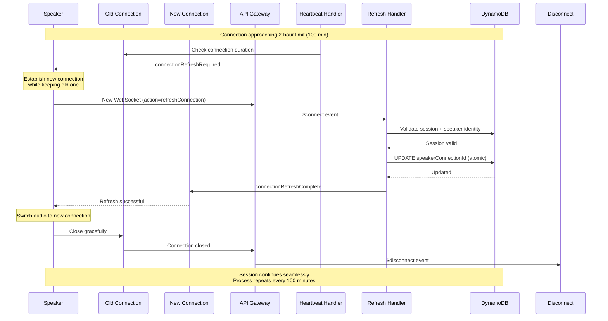

# Session Management & WebSocket Infrastructure
## Design Document v1.0

## Overview

This design document specifies the architecture and implementation details for the Session Management & WebSocket Infrastructure component. The system provides real-time bidirectional communication between speakers and listeners using AWS API Gateway WebSocket API, with session state managed in DynamoDB.

### Key Design Principles

1. **Serverless-First**: Leverage AWS managed services to minimize operational overhead
2. **Stateless Lambda Functions**: All state stored in DynamoDB for scalability
3. **Idempotent Operations**: Safe to retry without side effects
4. **Atomic State Updates**: Use DynamoDB conditional updates and atomic counters
5. **Graceful Degradation**: Handle partial failures without complete system outage
6. **Security by Default**: Authentication, encryption, rate limiting built-in

### Architecture Style

- **Event-Driven**: WebSocket events trigger Lambda functions
- **Microservices**: Separate Lambda functions for each concern
- **Database-Per-Service**: DynamoDB tables dedicated to this component
- **API Gateway Pattern**: Centralized entry point for all connections

## Architecture

### High-Level Component Diagram

```
┌─────────────────────────────────────────────────────────────────┐
│                         CLIENT LAYER                            │
├──────────────────┬──────────────────────────────────────────────┤
│   Speaker        │              Listeners                       │
│   Web Client     │              Web Clients                     │
│   - Auth UI      │              - Join UI                       │
│   - WebSocket    │              - WebSocket                     │
└────────┬─────────┴──────────────────┬───────────────────────────┘
         │                            │
         │ WSS + JWT                  │ WSS (no auth)
         │                            │
         ▼                            ▼
┌─────────────────────────────────────────────────────────────────┐
│                    API GATEWAY LAYER                            │
│  ┌──────────────────────────────────────────────────────────┐  │
│  │         API Gateway WebSocket API                        │  │
│  │  - $connect route                                        │  │
│  │  - $disconnect route                                     │  │
│  │  - heartbeat route                                       │  │
│  └────────┬─────────────────────────────────────────────────┘  │
└───────────┼─────────────────────────────────────────────────────┘
            │
            ├──────────────┬──────────────┬──────────────┐
            │              │              │              │
            ▼              ▼              ▼              ▼
┌─────────────────┐ ┌──────────┐ ┌──────────┐ ┌──────────────┐
│ Lambda          │ │ Lambda   │ │ Lambda   │ │ Lambda       │
│ Authorizer      │ │ Connect  │ │ Heartbeat│ │ Disconnect   │
│ - Validate JWT  │ │ Handler  │ │ Handler  │ │ Handler      │
└─────────────────┘ └────┬─────┘ └────┬─────┘ └──────┬───────┘
                         │            │               │
                         └────────────┼───────────────┘
                                      │
                         ┌────────────┴────────────┐
                         │                         │
                         ▼                         ▼
                  ┌─────────────┐          ┌─────────────┐
                  │  DynamoDB   │          │  DynamoDB   │
                  │  Sessions   │          │ Connections │
                  │  Table      │          │  Table      │
                  └─────────────┘          └─────────────┘
```


### Component Interaction Flow

**Speaker Session Creation Flow:**
```
1. Speaker → API Gateway: WSS connection with JWT + params
2. API Gateway → Lambda Authorizer: Validate JWT
3. Lambda Authorizer → Cognito: Verify token signature
4. Cognito → Lambda Authorizer: Token valid
5. Lambda Authorizer → API Gateway: Allow policy
6. API Gateway → Connect Handler: $connect event
7. Connect Handler → DynamoDB: Generate & store session
8. DynamoDB → Connect Handler: Session created
9. Connect Handler → API Gateway: sessionCreated message
10. API Gateway → Speaker: Session ID + connection details
```

**Listener Join Flow:**
```
1. Listener → API Gateway: WSS connection with sessionId + targetLanguage
2. API Gateway → Connect Handler: $connect event (no auth)
3. Connect Handler → DynamoDB: Validate session exists
4. DynamoDB → Connect Handler: Session valid
5. Connect Handler → DynamoDB: Create connection record
6. Connect Handler → DynamoDB: Increment listenerCount
7. Connect Handler → API Gateway: sessionJoined message
8. API Gateway → Listener: Join confirmation
```

**Disconnection Flow:**
```
1. Client closes connection
2. API Gateway → Disconnect Handler: $disconnect event
3. Disconnect Handler → DynamoDB: Query connection record
4. DynamoDB → Disconnect Handler: Connection details
5. Disconnect Handler → DynamoDB: Delete connection
6. Disconnect Handler → DynamoDB: Decrement listenerCount (if listener)
7. If speaker: Disconnect Handler → DynamoDB: Mark session inactive
8. If speaker: Disconnect Handler → API Gateway: Notify all listeners
```

**Connection Refresh Flow (for sessions > 2 hours):**
```
Speaker Refresh:
1. Heartbeat Handler detects 100-minute threshold
2. Heartbeat Handler → Speaker (old conn): connectionRefreshRequired message
3. Speaker establishes new WebSocket connection with action=refreshConnection
4. API Gateway → Connection Refresh Handler: New connection event
5. Connection Refresh Handler → DynamoDB: Validate session + speaker identity
6. Connection Refresh Handler → DynamoDB: Atomically update speakerConnectionId
7. Connection Refresh Handler → Speaker (new conn): connectionRefreshComplete
8. Speaker switches audio streaming to new connection
9. Speaker closes old connection gracefully
10. Old connection triggers $disconnect (cleanup handled idempotently)

Listener Refresh:
1. Heartbeat Handler detects 100-minute threshold
2. Heartbeat Handler → Listener (old conn): connectionRefreshRequired message
3. Listener establishes new WebSocket connection with action=refreshConnection
4. API Gateway → Connection Refresh Handler: New connection event
5. Connection Refresh Handler → DynamoDB: Validate session exists
6. Connection Refresh Handler → DynamoDB: Create new connection record
7. Connection Refresh Handler → DynamoDB: Increment listenerCount
8. Connection Refresh Handler → Listener (new conn): connectionRefreshComplete
9. Listener switches audio playback to new connection
10. Listener closes old connection
11. Old connection triggers $disconnect → decrement listenerCount
```

### Connection Refresh Sequence Diagram



## Components and Interfaces

### 1. Lambda Authorizer

**Purpose**: Authenticate speaker connections using JWT tokens

**Input**: 
- Event type: TOKEN
- Authorization token from query string parameter
- Method ARN

**Output**:
- IAM policy document (Allow/Deny)
- Principal ID (Cognito sub claim)
- Context (userId, email)

**Implementation**:
```python
import jwt
import requests
from functools import lru_cache

@lru_cache(maxsize=1)
def get_cognito_public_keys(region, user_pool_id):
    """Cache Cognito public keys for token validation."""
    jwks_url = f"https://cognito-idp.{region}.amazonaws.com/{user_pool_id}/.well-known/jwks.json"
    response = requests.get(jwks_url)
    return response.json()['keys']

def lambda_handler(event, context):
    """
    Validate JWT token and return IAM policy.
    """
    token = event['queryStringParameters'].get('token')
    
    if not token:
        raise Exception('Unauthorized')
    
    try:
        # Decode header to get key ID
        header = jwt.get_unverified_header(token)
        kid = header['kid']
        
        # Get public key
        keys = get_cognito_public_keys(REGION, USER_POOL_ID)
        public_key = next((k for k in keys if k['kid'] == kid), None)
        
        if not public_key:
            raise Exception('Public key not found')
        
        # Verify and decode token
        claims = jwt.decode(
            token,
            public_key,
            algorithms=['RS256'],
            audience=CLIENT_ID,
            issuer=f"https://cognito-idp.{REGION}.amazonaws.com/{USER_POOL_ID}"
        )
        
        # Return allow policy
        return {
            'principalId': claims['sub'],
            'policyDocument': {
                'Version': '2012-10-17',
                'Statement': [{
                    'Action': 'execute-api:Invoke',
                    'Effect': 'Allow',
                    'Resource': event['methodArn']
                }]
            },
            'context': {
                'userId': claims['sub'],
                'email': claims.get('email', '')
            }
        }
    
    except Exception as e:
        logger.error(f"Authorization failed: {str(e)}")
        raise Exception('Unauthorized')
```


### 2. Connection Handler Lambda

**Purpose**: Handle $connect events for both speakers and listeners

**Input**:
- Event type: $connect
- Query string parameters: action, sessionId, sourceLanguage, targetLanguage, qualityTier
- Request context: connectionId, authorizer context (for speakers)

**Output**:
- Status code: 200 (success), 400 (bad request), 404 (not found), 429 (rate limit)
- Response body: JSON message

**Key Functions**:

1. **create_session()** - For speakers
2. **join_session()** - For listeners
3. **generate_session_id()** - Generate human-readable ID
4. **validate_parameters()** - Input validation
5. **check_rate_limit()** - Abuse prevention

**Implementation Outline**:
```python
def lambda_handler(event, context):
    """
    Handle WebSocket $connect event.
    """
    connection_id = event['requestContext']['connectionId']
    query_params = event.get('queryStringParameters', {})
    action = query_params.get('action')
    
    try:
        if action == 'createSession':
            # Speaker creating new session
            return handle_create_session(event, connection_id, query_params)
        elif action == 'joinSession':
            # Listener joining existing session
            return handle_join_session(event, connection_id, query_params)
        else:
            return error_response(400, 'INVALID_ACTION', 'Action must be createSession or joinSession')
    
    except RateLimitExceeded as e:
        return error_response(429, 'RATE_LIMIT_EXCEEDED', str(e), {'retryAfter': e.retry_after})
    except SessionNotFound:
        return error_response(404, 'SESSION_NOT_FOUND', 'Session does not exist or is inactive')
    except ValidationError as e:
        return error_response(400, 'INVALID_PARAMETERS', str(e))
    except Exception as e:
        logger.error(f"Unexpected error: {str(e)}", exc_info=True)
        return error_response(500, 'INTERNAL_ERROR', 'An unexpected error occurred')
```

### 3. Session ID Generator

**Purpose**: Generate unique, human-readable session IDs

**Algorithm**:
```python
import random
import hashlib

class SessionIDGenerator:
    """
    Generate human-readable session IDs.
    """
    
    ADJECTIVES = [
        'faithful', 'blessed', 'gracious', 'righteous', 'holy', 'merciful', 'glorious',
        'eternal', 'divine', 'sacred', 'humble', 'joyful', 'peaceful', 'loving',
        'truthful', 'pure', 'gentle', 'patient', 'kind', 'steadfast', 'wise',
        # ... 100+ Christian/Bible-themed adjectives
    ]
    
    NOUNS = [
        'shepherd', 'covenant', 'temple', 'prophet', 'apostle', 'disciple', 'altar',
        'sanctuary', 'psalm', 'gospel', 'grace', 'faith', 'hope', 'light', 'truth',
        'wisdom', 'mercy', 'glory', 'spirit', 'cross', 'crown', 'vine', 'lamb',
        # ... 100+ Christian/Bible-themed nouns
    ]
    
    BLACKLIST = {'bad', 'evil', 'ugly', 'stupid'}  # Profanity filter
    
    def generate(self, max_attempts=10):
        """
        Generate unique session ID.
        
        Returns:
            str: Session ID in format {adjective}-{noun}-{number}
        """
        for attempt in range(max_attempts):
            adjective = random.choice(self.ADJECTIVES)
            noun = random.choice(self.NOUNS)
            number = random.randint(100, 999)
            
            # Check blacklist
            if adjective in self.BLACKLIST or noun in self.BLACKLIST:
                continue
            
            session_id = f"{adjective}-{noun}-{number}"
            
            # Check uniqueness in DynamoDB
            if self._is_unique(session_id):
                return session_id
        
        raise RuntimeError("Failed to generate unique session ID after max attempts")
    
    def _is_unique(self, session_id):
        """Check if session ID exists in active sessions."""
        response = dynamodb.get_item(
            TableName='Sessions',
            Key={'sessionId': session_id}
        )
        return 'Item' not in response
```


### 4. Connection Refresh Handler Lambda

**Purpose**: Handle seamless connection refresh for sessions longer than 2 hours

**Input**:
- Event type: refreshConnection route
- Query parameters: sessionId, role (speaker/listener), targetLanguage (for listeners)
- Authorization context (for speakers)

**Output**:
- connectionRefreshComplete message
- Updated session/connection records

**Implementation**:
```python
def lambda_handler(event, context):
    """
    Handle connection refresh for long-running sessions.
    """
    connection_id = event['requestContext']['connectionId']
    query_params = event.get('queryStringParameters', {})
    session_id = query_params.get('sessionId')
    role = query_params.get('role')
    
    try:
        # Validate session exists
        session = get_session(session_id)
        if not session or not session['isActive']:
            return error_response(404, 'SESSION_NOT_FOUND', 'Session not found or inactive')
        
        if role == 'speaker':
            # Validate speaker identity matches
            authorizer_context = event['requestContext'].get('authorizer', {})
            user_id = authorizer_context.get('userId')
            
            if user_id != session['speakerUserId']:
                return error_response(403, 'FORBIDDEN', 'Speaker identity mismatch')
            
            # Atomically update speaker connection ID
            update_speaker_connection(session_id, connection_id)
            
            # Send completion message
            send_message(connection_id, {
                'type': 'connectionRefreshComplete',
                'sessionId': session_id,
                'role': 'speaker',
                'timestamp': int(time.time() * 1000)
            })
            
        elif role == 'listener':
            target_language = query_params.get('targetLanguage')
            
            # Create new connection record
            create_connection_record(connection_id, session_id, target_language, 'listener')
            
            # Increment listener count
            increment_listener_count(session_id)
            
            # Send completion message
            send_message(connection_id, {
                'type': 'connectionRefreshComplete',
                'sessionId': session_id,
                'targetLanguage': target_language,
                'role': 'listener',
                'timestamp': int(time.time() * 1000)
            })
        
        logger.info(f"Connection refresh completed for {role} in session {session_id}")
        return {'statusCode': 200}
    
    except Exception as e:
        logger.error(f"Connection refresh error: {str(e)}", exc_info=True)
        return error_response(500, 'INTERNAL_ERROR', 'Connection refresh failed')

def update_speaker_connection(session_id, new_connection_id):
    """Atomically update speaker connection ID."""
    dynamodb.update_item(
        TableName='Sessions',
        Key={'sessionId': session_id},
        UpdateExpression='SET speakerConnectionId = :new_conn',
        ConditionExpression='attribute_exists(sessionId) AND isActive = :true',
        ExpressionAttributeValues={
            ':new_conn': new_connection_id,
            ':true': True
        }
    )
```

### 5. Heartbeat Handler Lambda

**Purpose**: Respond to heartbeat messages and check connection duration warnings

**Input**:
- Event type: heartbeat route
- Connection ID
- Timestamp

**Output**:
- heartbeatAck message
- connectionWarning message (if approaching timeout)
- connectionRefreshRequired message (if refresh needed)

**Implementation**:
```python
def lambda_handler(event, context):
    """
    Handle heartbeat messages and check for connection duration warnings and refresh requirements.
    """
    connection_id = event['requestContext']['connectionId']
    
    try:
        # Get connection details to check duration
        connection = get_connection(connection_id)
        
        if connection:
            connected_at = connection['connectedAt']
            current_time = int(time.time() * 1000)
            duration_minutes = (current_time - connected_at) / (1000 * 60)
            
            refresh_threshold = int(os.environ.get('CONNECTION_REFRESH_MINUTES', 100))
            warning_threshold = int(os.environ.get('CONNECTION_WARNING_MINUTES', 105))
            
            # Check if connection refresh is needed (for long sessions)
            if duration_minutes >= refresh_threshold and duration_minutes < refresh_threshold + 1:
                # Send refresh required message (only once when threshold is crossed)
                send_connection_refresh_required(connection_id, connection)
            
            # Check if connection is approaching timeout
            elif duration_minutes >= warning_threshold:
                # Send warning message
                send_connection_warning(connection_id, duration_minutes)
        
        # Send heartbeat acknowledgment
        api_gateway = boto3.client('apigatewaymanagementapi',
            endpoint_url=f"https://{API_ID}.execute-api.{REGION}.amazonaws.com/{STAGE}")
        
        api_gateway.post_to_connection(
            ConnectionId=connection_id,
            Data=json.dumps({
                'type': 'heartbeatAck',
                'timestamp': int(time.time() * 1000)
            })
        )
        
        return {'statusCode': 200}
    
    except api_gateway.exceptions.GoneException:
        # Connection no longer exists
        logger.warning(f"Connection {connection_id} gone during heartbeat")
        return {'statusCode': 410}
    except Exception as e:
        logger.error(f"Heartbeat error: {str(e)}")
        return {'statusCode': 500}

def send_connection_refresh_required(connection_id, connection):
    """Send connection refresh required message for seamless reconnection."""
    api_gateway.post_to_connection(
        ConnectionId=connection_id,
        Data=json.dumps({
            'type': 'connectionRefreshRequired',
            'sessionId': connection['sessionId'],
            'role': connection['role'],
            'targetLanguage': connection.get('targetLanguage'),
            'message': 'Please establish new connection to continue session',
            'timestamp': int(time.time() * 1000)
        })
    )

def send_connection_warning(connection_id, duration_minutes):
    """Send connection duration warning."""
    max_duration = int(os.environ.get('CONNECTION_MAX_DURATION_HOURS', 2)) * 60
    remaining_minutes = max_duration - duration_minutes
    
    api_gateway.post_to_connection(
        ConnectionId=connection_id,
        Data=json.dumps({
            'type': 'connectionWarning',
            'message': f'Connection will expire in {remaining_minutes:.0f} minutes',
            'remainingMinutes': remaining_minutes,
            'timestamp': int(time.time() * 1000)
        })
    )
```

### 6. Disconnect Handler Lambda

**Purpose**: Clean up resources when connections close

**Input**:
- Event type: $disconnect
- Connection ID

**Output**:
- Status code: 200

**Key Operations**:
1. Query connection record from DynamoDB
2. Determine role (speaker or listener)
3. Delete connection record
4. Update session state (decrement count or mark inactive)
5. Notify other participants if speaker disconnected

**Implementation Outline**:
```python
def lambda_handler(event, context):
    """
    Handle WebSocket $disconnect event.
    """
    connection_id = event['requestContext']['connectionId']
    
    try:
        # Get connection details
        connection = get_connection(connection_id)
        
        if not connection:
            logger.warning(f"Connection {connection_id} not found in database")
            return {'statusCode': 200}  # Idempotent
        
        session_id = connection['sessionId']
        role = connection['role']
        
        # Delete connection record
        delete_connection(connection_id)
        
        if role == 'speaker':
            # Speaker disconnected - end session
            handle_speaker_disconnect(session_id, connection_id)
        else:
            # Listener disconnected - decrement count
            handle_listener_disconnect(session_id)
        
        logger.info(f"Disconnected {role} from session {session_id}")
        return {'statusCode': 200}
    
    except Exception as e:
        logger.error(f"Disconnect error: {str(e)}", exc_info=True)
        return {'statusCode': 200}  # Return success to avoid retries
```

## Data Models

### DynamoDB Tables

#### Sessions Table

**Table Name**: `Sessions`

**Primary Key**: 
- Partition Key: `sessionId` (String)

**Attributes**:
```json
{
  "sessionId": "golden-eagle-427",
  "speakerConnectionId": "L0SM9cOFvHcCIhw=",
  "sourceLanguage": "en",
  "createdAt": 1699500000000,
  "isActive": true,
  "listenerCount": 15,
  "qualityTier": "standard",
  "expiresAt": 1699510800000,
  "speakerUserId": "a1b2c3d4-e5f6-7890-abcd-ef1234567890"
}
```

**Indexes**: None

**TTL**: Enabled on `expiresAt` attribute

**Capacity Mode**: On-demand

**Encryption**: AWS-managed keys


#### Connections Table

**Table Name**: `Connections`

**Primary Key**:
- Partition Key: `connectionId` (String)

**Global Secondary Index**: `sessionId-targetLanguage-index`
- Partition Key: `sessionId` (String)
- Sort Key: `targetLanguage` (String)
- Projection: ALL

**Attributes**:
```json
{
  "connectionId": "K3Rx8bNEuGdDJkx=",
  "sessionId": "golden-eagle-427",
  "targetLanguage": "es",
  "role": "listener",
  "connectedAt": 1699500120000,
  "ttl": 1699510800,
  "ipAddress": "198.51.100.17"
}
```

**Capacity Mode**: On-demand

**TTL**: Enabled on `ttl` attribute

#### RateLimits Table

**Table Name**: `RateLimits`

**Primary Key**:
- Partition Key: `identifier` (String) - Format: `{operation}:{type}:{value}`

**Attributes**:
```json
{
  "identifier": "session_create:user:a1b2c3d4-e5f6-7890",
  "count": 3,
  "windowStart": 1699500000000,
  "expiresAt": 1699503600
}
```

**TTL**: Enabled on `expiresAt` attribute

**Capacity Mode**: On-demand

### Data Access Patterns

**Pattern 1: Get Session by ID**
```python
response = dynamodb.get_item(
    TableName='Sessions',
    Key={'sessionId': 'golden-eagle-427'}
)
session = response.get('Item')
```

**Pattern 2: Get All Listeners for Session and Language**
```python
response = dynamodb.query(
    TableName='Connections',
    IndexName='sessionId-targetLanguage-index',
    KeyConditionExpression='sessionId = :sid AND targetLanguage = :lang',
    ExpressionAttributeValues={
        ':sid': 'golden-eagle-427',
        ':lang': 'es'
    }
)
listeners = response['Items']
```

**Pattern 3: Get Unique Languages for Session**
```python
response = dynamodb.query(
    TableName='Connections',
    IndexName='sessionId-targetLanguage-index',
    KeyConditionExpression='sessionId = :sid',
    FilterExpression='#role = :role',
    ExpressionAttributeNames={'#role': 'role'},
    ExpressionAttributeValues={
        ':sid': 'golden-eagle-427',
        ':role': 'listener'
    }
)
languages = set(item['targetLanguage'] for item in response['Items'])
```

**Pattern 4: Atomic Listener Count Increment**
```python
dynamodb.update_item(
    TableName='Sessions',
    Key={'sessionId': 'golden-eagle-427'},
    UpdateExpression='ADD listenerCount :inc',
    ExpressionAttributeValues={':inc': 1}
)
```

**Pattern 5: Atomic Listener Count Decrement with Floor**
```python
dynamodb.update_item(
    TableName='Sessions',
    Key={'sessionId': 'golden-eagle-427'},
    UpdateExpression='SET listenerCount = if_not_exists(listenerCount, :zero) - :dec',
    ConditionExpression='listenerCount > :zero',
    ExpressionAttributeValues={
        ':dec': 1,
        ':zero': 0
    }
)
```

### Language Support Validation

**Purpose**: Validate that target language is supported by both AWS Translate and AWS Polly

**Implementation**:
```python
import boto3
from functools import lru_cache

class LanguageValidator:
    """
    Validates language support for AWS Translate and Polly.
    """
    
    def __init__(self):
        self.translate_client = boto3.client('translate')
        self.polly_client = boto3.client('polly')
    
    @lru_cache(maxsize=1)
    def get_supported_languages(self):
        """
        Get supported languages from AWS services (cached).
        
        Returns:
            dict: {
                'translate': set of supported language codes,
                'polly': set of supported language codes with neural voices
            }
        """
        # Get AWS Translate supported languages
        translate_response = self.translate_client.list_languages()
        translate_languages = {lang['LanguageCode'] for lang in translate_response['Languages']}
        
        # Get AWS Polly neural voices
        polly_response = self.polly_client.describe_voices(Engine='neural')
        polly_languages = {voice['LanguageCode'][:2] for voice in polly_response['Voices']}
        
        return {
            'translate': translate_languages,
            'polly': polly_languages
        }
    
    def validate_language_pair(self, source_language, target_language):
        """
        Validate that source→target translation is supported.
        
        Args:
            source_language: ISO 639-1 source language code
            target_language: ISO 639-1 target language code
        
        Returns:
            tuple: (is_valid, error_message)
        """
        supported = self.get_supported_languages()
        
        # Check AWS Translate support
        if source_language not in supported['translate']:
            return False, f"Source language '{source_language}' not supported by AWS Translate"
        
        if target_language not in supported['translate']:
            return False, f"Target language '{target_language}' not supported by AWS Translate"
        
        # Check AWS Polly neural voice support
        if target_language not in supported['polly']:
            return False, f"Target language '{target_language}' does not have neural voice support in AWS Polly"
        
        return True, None

# Usage in Connection Handler
language_validator = LanguageValidator()

def validate_listener_join(source_language, target_language):
    """Validate language support for listener join."""
    is_valid, error_message = language_validator.validate_language_pair(
        source_language, target_language
    )
    
    if not is_valid:
        raise UnsupportedLanguageError(error_message)
```

## Error Handling

### Error Response Format

All errors follow consistent JSON structure:
```json
{
  "type": "error",
  "code": "ERROR_CODE",
  "message": "Human-readable error message",
  "timestamp": 1699500123456,
  "requestId": "abc-123-def-456",
  "details": {
    "field": "sessionId",
    "reason": "Session not found"
  }
}
```

### Error Codes and HTTP Status Mapping

| Error Code | HTTP Status | Retry | Description |
|------------|-------------|-------|-------------|
| UNAUTHORIZED | 401 | No | Invalid or missing JWT token |
| FORBIDDEN | 403 | No | Valid token but insufficient permissions |
| SESSION_NOT_FOUND | 404 | No | Session doesn't exist or inactive |
| INVALID_PARAMETERS | 400 | No | Missing or malformed parameters |
| INVALID_SESSION_ID | 400 | No | Session ID format invalid |
| UNSUPPORTED_LANGUAGE | 400 | No | Language code not supported |
| RATE_LIMIT_EXCEEDED | 429 | Yes | Too many requests, retry after delay |
| SESSION_FULL | 503 | Yes | Max 1000 listeners reached |
| INTERNAL_ERROR | 500 | Yes | Unexpected server error |
| SERVICE_UNAVAILABLE | 503 | Yes | Dependency unavailable |


### Retry Strategy

**Exponential Backoff**:
```python
def retry_with_backoff(operation, max_retries=3, base_delay=1):
    """
    Retry operation with exponential backoff.
    
    Args:
        operation: Callable to retry
        max_retries: Maximum retry attempts
        base_delay: Initial delay in seconds
    
    Returns:
        Operation result
    
    Raises:
        Last exception if all retries fail
    """
    for attempt in range(max_retries):
        try:
            return operation()
        except RetryableError as e:
            if attempt == max_retries - 1:
                raise
            
            delay = base_delay * (2 ** attempt)  # 1s, 2s, 4s
            jitter = random.uniform(0, 0.1 * delay)  # Add jitter
            time.sleep(delay + jitter)
            
            logger.warning(f"Retry attempt {attempt + 1}/{max_retries} after {delay}s")
```

**Circuit Breaker Pattern**:
```python
class CircuitBreaker:
    """
    Circuit breaker for DynamoDB operations.
    """
    
    def __init__(self, failure_threshold=5, timeout=30):
        self.failure_threshold = failure_threshold
        self.timeout = timeout
        self.failure_count = 0
        self.last_failure_time = None
        self.state = 'CLOSED'  # CLOSED, OPEN, HALF_OPEN
    
    def call(self, operation):
        """Execute operation with circuit breaker."""
        if self.state == 'OPEN':
            if time.time() - self.last_failure_time > self.timeout:
                self.state = 'HALF_OPEN'
            else:
                raise CircuitBreakerOpen("Circuit breaker is open")
        
        try:
            result = operation()
            if self.state == 'HALF_OPEN':
                self.state = 'CLOSED'
                self.failure_count = 0
            return result
        
        except Exception as e:
            self.failure_count += 1
            self.last_failure_time = time.time()
            
            if self.failure_count >= self.failure_threshold:
                self.state = 'OPEN'
            
            raise
```

## Testing Strategy

### Unit Tests

**Test Coverage Requirements**:
- Minimum 80% code coverage
- 100% coverage for critical paths (authentication, state updates)

**Key Test Cases**:

1. **Session ID Generation**
   - Format validation
   - Uniqueness verification
   - Blacklist filtering
   - Max retry handling

2. **JWT Validation**
   - Valid token acceptance
   - Expired token rejection
   - Invalid signature rejection
   - Wrong audience rejection

3. **Rate Limiting**
   - Within limit acceptance
   - Limit exceeded rejection
   - Window reset behavior
   - Concurrent request handling

4. **Connection State Management**
   - Atomic counter updates
   - Race condition handling
   - Idempotent operations

### Integration Tests

**Test Scenarios**:

1. **Complete Speaker Flow**
   - Authenticate with Cognito
   - Connect to WebSocket
   - Receive session ID
   - Verify session in DynamoDB
   - Disconnect and verify cleanup

2. **Complete Listener Flow**
   - Join active session
   - Verify connection record
   - Verify listener count increment
   - Disconnect and verify count decrement

3. **Multi-Listener Scenario**
   - Create session
   - Join 100 listeners
   - Verify all connections active
   - Speaker disconnects
   - Verify all listeners notified

4. **Error Scenarios**
   - Invalid token rejection
   - Non-existent session rejection
   - Rate limit enforcement
   - Capacity limit enforcement

### Load Tests

**Performance Targets**:
- Session creation: <2s p95 latency
- Listener join: <1s p95 latency
- Heartbeat response: <100ms p95 latency
- Disconnect cleanup: <500ms p95 latency

**Load Test Scenarios**:

1. **Concurrent Sessions**: 100 simultaneous session creations
2. **Listener Surge**: 500 listeners joining single session (max capacity)
3. **Sustained Load**: 50 sessions with 50 listeners each for 2 hours (API Gateway maximum)
4. **Disconnect Storm**: 500 simultaneous disconnections

### Security Tests

**Security Test Cases**:

1. **Authentication Bypass Attempts**
   - No token provided
   - Malformed token
   - Token from different user pool
   - Expired token

2. **Authorization Tests**
   - Listener cannot send audio
   - Speaker cannot join as listener simultaneously
   - Cross-session access attempts

3. **Input Validation**
   - SQL injection attempts
   - XSS attempts
   - Oversized payloads
   - Invalid character sets

4. **Rate Limit Evasion**
   - IP rotation attempts
   - Distributed requests
   - Token reuse


## Deployment and Infrastructure

### AWS Resources

**API Gateway WebSocket API**:
```yaml
Type: AWS::ApiGatewayV2::Api
Properties:
  Name: translation-websocket-api
  ProtocolType: WEBSOCKET
  RouteSelectionExpression: $request.body.action
```

**Lambda Functions**:
- Authorizer: 128MB memory, 5s timeout
- Connect Handler: 256MB memory, 10s timeout
- Heartbeat Handler: 128MB memory, 3s timeout
- Disconnect Handler: 256MB memory, 10s timeout

**DynamoDB Tables**:
- Sessions: On-demand, TTL enabled
- Connections: On-demand, TTL enabled, GSI
- RateLimits: On-demand, TTL enabled

**IAM Roles**:
- Lambda execution role with DynamoDB, CloudWatch Logs, API Gateway Management API permissions
- API Gateway role for Lambda invocation

### Environment Variables

```bash
# Lambda Environment Variables
REGION=us-east-1
USER_POOL_ID=us-east-1_ABC123
CLIENT_ID=abc123def456
SESSIONS_TABLE=Sessions
CONNECTIONS_TABLE=Connections
RATE_LIMITS_TABLE=RateLimits
API_GATEWAY_ENDPOINT=https://abc123.execute-api.us-east-1.amazonaws.com/prod

# Configurable Limits
MAX_LISTENERS_PER_SESSION=500
SESSION_MAX_DURATION_HOURS=2  # API Gateway WebSocket hard limit: 2 hours maximum
CONNECTION_MAX_DURATION_HOURS=2  # API Gateway WebSocket hard limit: 2 hours maximum
CONNECTION_WARNING_MINUTES=105  # Warn at 1h 45min (15 minutes before 2-hour cutoff)
CONNECTION_REFRESH_MINUTES=100  # Trigger seamless reconnection at 1h 40min (20 min buffer)
DATA_RETENTION_HOURS=12

# Rate Limiting
RATE_LIMIT_SESSIONS_PER_HOUR=50
RATE_LIMIT_LISTENER_JOINS_PER_MIN=10
RATE_LIMIT_CONNECTION_ATTEMPTS_PER_MIN=20
RATE_LIMIT_HEARTBEATS_PER_MIN=2

# Heartbeat Configuration
HEARTBEAT_INTERVAL_SECONDS=30
HEARTBEAT_TIMEOUT_SECONDS=90

LOG_LEVEL=INFO
```

### Monitoring and Observability

**CloudWatch Metrics**:
- `SessionCreationLatency` - p50, p95, p99
- `ListenerJoinLatency` - p50, p95, p99
- `ActiveSessions` - gauge
- `TotalListeners` - gauge
- `ConnectionErrors` - count by error code
- `RateLimitExceeded` - count
- `HeartbeatLatency` - p95

**CloudWatch Alarms**:
```yaml
SessionCreationLatencyAlarm:
  Metric: SessionCreationLatency
  Statistic: p95
  Threshold: 2000ms
  EvaluationPeriods: 2
  Action: SNS notification

ConnectionErrorRateAlarm:
  Metric: ConnectionErrors
  Statistic: Sum
  Threshold: 100 errors/5min
  EvaluationPeriods: 1
  Action: SNS notification

ActiveSessionsAlarm:
  Metric: ActiveSessions
  Statistic: Average
  Threshold: 90 sessions
  EvaluationPeriods: 1
  Action: SNS notification (approaching limit)
```

**CloudWatch Logs**:
- Log Group: `/aws/lambda/translation-websocket`
- Retention: 12 hours (configurable via DATA_RETENTION_HOURS)
- Log Level: INFO (ERROR for production)

**Structured Logging Format**:
```json
{
  "timestamp": "2025-11-09T00:30:15.123Z",
  "level": "INFO",
  "correlationId": "golden-eagle-427",
  "operation": "createSession",
  "userId": "a1b2c3d4-e5f6-7890",
  "duration": 1234,
  "message": "Session created successfully"
}
```

### Cost Optimization

**Estimated Monthly Costs** (100 sessions/day, avg 50 listeners, 30min duration):

| Service | Usage | Cost |
|---------|-------|------|
| API Gateway | 15M messages | $15 |
| Lambda | 30M invocations, 1GB-sec | $20 |
| DynamoDB | 10M writes, 50M reads | $15 |
| CloudWatch Logs | 10GB | $5 |
| **Total** | | **~$55/month** |

**Cost Optimization Strategies**:
1. Use on-demand DynamoDB (no idle costs)
2. Enable TTL for automatic cleanup
3. Use Lambda provisioned concurrency only if cold starts become issue
4. Compress CloudWatch Logs
5. Use 12-hour log retention (configurable via DATA_RETENTION_HOURS)

### Security Hardening

**Network Security**:
- API Gateway in VPC (optional for private deployments)
- Lambda in VPC with NAT Gateway (if accessing VPC resources)
- Security groups restricting outbound traffic

**Data Protection**:
- TLS 1.2+ for all connections
- DynamoDB encryption at rest not required (no sensitive data stored)
- CloudWatch Logs encryption optional
- Secrets Manager for JWT validation keys only

**Access Control**:
- Least privilege IAM roles
- Resource-based policies on Lambda
- API Gateway resource policies (optional IP whitelist)

**Audit and Compliance**:
- CloudTrail logging for API calls
- AWS Config for resource compliance
- VPC Flow Logs (if in VPC)

### Disaster Recovery

**Backup Strategy**:
- DynamoDB Point-in-Time Recovery (PITR) enabled
- Lambda function code in version control
- Infrastructure as Code (CDK/CloudFormation)

**Recovery Procedures**:

1. **DynamoDB Table Loss**:
   - Restore from PITR (up to 35 days)
   - Recreate table from IaC if beyond retention

2. **Lambda Function Issues**:
   - Rollback to previous version
   - Redeploy from version control

3. **API Gateway Issues**:
   - Recreate from IaC
   - Update DNS if using custom domain

**RTO/RPO Targets**:
- Recovery Time Objective (RTO): 1 hour
- Recovery Point Objective (RPO): 5 minutes (PITR granularity)

## Performance Optimization

### Lambda Optimization

**Cold Start Mitigation**:
```python
# Initialize outside handler for reuse
dynamodb = boto3.resource('dynamodb')
sessions_table = dynamodb.Table(SESSIONS_TABLE)
connections_table = dynamodb.Table(CONNECTIONS_TABLE)

# Cache Cognito public keys
@lru_cache(maxsize=1)
def get_public_keys():
    # Cached for Lambda container lifetime
    pass

def lambda_handler(event, context):
    # Handler code uses cached resources
    pass
```

**Memory Allocation**:
- Start with 256MB
- Monitor actual usage
- Increase if CPU-bound operations

**Timeout Configuration**:
- Connect/Disconnect: 10s (DynamoDB operations)
- Heartbeat: 3s (simple response)
- Authorizer: 5s (external Cognito call)

### DynamoDB Optimization

**Query Optimization**:
- Use GSI for non-primary key queries
- Project only needed attributes
- Use consistent reads only when necessary

**Batch Operations**:
```python
# Batch write for multiple connections
with connections_table.batch_writer() as batch:
    for connection in connections:
        batch.put_item(Item=connection)
```

**Conditional Updates**:
```python
# Prevent race conditions
dynamodb.update_item(
    Key={'sessionId': session_id},
    UpdateExpression='SET listenerCount = listenerCount + :inc',
    ConditionExpression='attribute_exists(sessionId) AND isActive = :true',
    ExpressionAttributeValues={':inc': 1, ':true': True}
)
```

### API Gateway Optimization

**Connection Throttling**:
- Burst limit: 5000 requests
- Steady-state: 10000 requests/second

**Message Size Limits**:
- Maximum message size: 128KB
- Recommend keeping messages <32KB

**Route Optimization**:
- Use $default route for catch-all
- Minimize route selection expression complexity

## Client Implementation Guide

This section provides guidance for client-side implementation of the WebSocket connection management, including seamless connection refresh for long sessions.

### Speaker Client Behavior

**Initial Connection:**
```javascript
// Establish WebSocket connection with JWT authentication
const wsUrl = `wss://api-gateway-endpoint/prod?token=${jwtToken}&action=createSession&sourceLanguage=en&qualityTier=standard`;
const ws = new WebSocket(wsUrl);

ws.onmessage = (event) => {
  const message = JSON.parse(event.data);
  
  switch(message.type) {
    case 'sessionCreated':
      console.log('Session ID:', message.sessionId);
      // Start audio streaming
      break;
      
    case 'connectionRefreshRequired':
      handleSpeakerRefresh(message);
      break;
      
    case 'connectionWarning':
      console.warn('Connection expires in', message.remainingMinutes, 'minutes');
      break;
  }
};
```

**Connection Refresh (at 100 minutes):**
```javascript
function handleSpeakerRefresh(message) {
  const sessionId = message.sessionId;
  
  // 1. Establish new connection while keeping old one active
  const newWsUrl = `wss://api-gateway-endpoint/prod?token=${jwtToken}&action=refreshConnection&sessionId=${sessionId}&role=speaker`;
  const newWs = new WebSocket(newWsUrl);
  
  newWs.onmessage = (event) => {
    const msg = JSON.parse(event.data);
    
    if (msg.type === 'connectionRefreshComplete') {
      // 2. Switch audio streaming to new connection
      switchAudioStreamToNewConnection(newWs);
      
      // 3. Close old connection gracefully
      oldWs.close(1000, 'Connection refresh');
      
      // 4. Update reference to new connection
      ws = newWs;
      
      console.log('Connection refresh completed successfully');
    }
  };
  
  newWs.onerror = (error) => {
    console.error('Refresh failed, retrying in 30 seconds:', error);
    setTimeout(() => handleSpeakerRefresh(message), 30000);
  };
}
```

**Heartbeat Implementation:**
```javascript
// Send heartbeat every 30 seconds
setInterval(() => {
  if (ws.readyState === WebSocket.OPEN) {
    ws.send(JSON.stringify({ action: 'heartbeat' }));
  }
}, 30000);
```

### Listener Client Behavior

**Initial Connection:**
```javascript
// Establish WebSocket connection (no authentication required)
const wsUrl = `wss://api-gateway-endpoint/prod?action=joinSession&sessionId=${sessionId}&targetLanguage=es`;
const ws = new WebSocket(wsUrl);

ws.onmessage = (event) => {
  const message = JSON.parse(event.data);
  
  switch(message.type) {
    case 'sessionJoined':
      console.log('Joined session:', message.sessionId);
      // Start audio playback
      break;
      
    case 'connectionRefreshRequired':
      handleListenerRefresh(message);
      break;
      
    case 'sessionEnded':
      console.log('Session ended by speaker');
      ws.close();
      break;
  }
};
```

**Connection Refresh (at 100 minutes):**
```javascript
function handleListenerRefresh(message) {
  const { sessionId, targetLanguage } = message;
  
  // 1. Establish new connection while keeping old one for audio playback
  const newWsUrl = `wss://api-gateway-endpoint/prod?action=refreshConnection&sessionId=${sessionId}&targetLanguage=${targetLanguage}&role=listener`;
  const newWs = new WebSocket(newWsUrl);
  
  newWs.onmessage = (event) => {
    const msg = JSON.parse(event.data);
    
    if (msg.type === 'connectionRefreshComplete') {
      // 2. Switch audio playback to new connection
      switchAudioPlaybackToNewConnection(newWs);
      
      // 3. Close old connection gracefully
      oldWs.close(1000, 'Connection refresh');
      
      // 4. Update reference to new connection
      ws = newWs;
      
      console.log('Connection refresh completed successfully');
    }
  };
  
  newWs.onerror = (error) => {
    console.error('Refresh failed, retrying in 30 seconds:', error);
    setTimeout(() => handleListenerRefresh(message), 30000);
  };
}
```

### Error Handling Best Practices

**Connection Refresh Failure:**
```javascript
function handleRefreshWithRetry(message, retryCount = 0, maxRetries = 5) {
  const backoffDelay = Math.min(30000 * Math.pow(2, retryCount), 300000); // Max 5 min
  
  // Attempt refresh
  const newWs = establishNewConnection(message);
  
  newWs.onerror = (error) => {
    if (retryCount < maxRetries) {
      console.warn(`Refresh attempt ${retryCount + 1} failed, retrying in ${backoffDelay}ms`);
      setTimeout(() => {
        handleRefreshWithRetry(message, retryCount + 1, maxRetries);
      }, backoffDelay);
    } else {
      console.error('Max refresh retries exceeded, connection will expire at 2-hour mark');
      // Old connection remains active until API Gateway closes it at 2 hours
    }
  };
}
```

**Reconnection After Unexpected Disconnect:**
```javascript
ws.onclose = (event) => {
  if (event.code !== 1000) { // Not a normal closure
    console.warn('Unexpected disconnect, attempting to rejoin session');
    
    // For listeners: rejoin the session
    setTimeout(() => {
      rejoinSession(sessionId, targetLanguage);
    }, 1000);
    
    // For speakers: session is terminated, cannot rejoin
  }
};

function rejoinSession(sessionId, targetLanguage) {
  const wsUrl = `wss://api-gateway-endpoint/prod?action=joinSession&sessionId=${sessionId}&targetLanguage=${targetLanguage}`;
  ws = new WebSocket(wsUrl);
  // ... setup event handlers
}
```

### Audio Buffer Management During Refresh

**Seamless Audio Transition:**
```javascript
class AudioConnectionManager {
  constructor() {
    this.audioQueue = [];
    this.currentConnection = null;
    this.isTransitioning = false;
  }
  
  switchConnection(newConnection) {
    this.isTransitioning = true;
    
    // Buffer audio from old connection during transition
    this.currentConnection.onmessage = (event) => {
      this.audioQueue.push(event.data);
    };
    
    // Start receiving from new connection
    newConnection.onmessage = (event) => {
      if (this.isTransitioning) {
        // Flush buffered audio first
        while (this.audioQueue.length > 0) {
          this.playAudio(this.audioQueue.shift());
        }
        this.isTransitioning = false;
      }
      this.playAudio(event.data);
    };
    
    this.currentConnection = newConnection;
  }
  
  playAudio(audioData) {
    // Play audio through Web Audio API or HTML5 Audio
  }
}
```

### Connection State Tracking

**Client-Side Connection Manager:**
```javascript
class WebSocketConnectionManager {
  constructor(config) {
    this.config = config;
    this.ws = null;
    this.connectionStartTime = null;
    this.refreshThreshold = 100 * 60 * 1000; // 100 minutes in ms
    this.checkInterval = null;
  }
  
  connect() {
    this.ws = new WebSocket(this.config.url);
    this.connectionStartTime = Date.now();
    this.setupEventHandlers();
    this.startConnectionMonitoring();
  }
  
  startConnectionMonitoring() {
    // Check connection age every minute
    this.checkInterval = setInterval(() => {
      const connectionAge = Date.now() - this.connectionStartTime;
      
      if (connectionAge >= this.refreshThreshold) {
        console.log('Connection approaching 2-hour limit, waiting for server refresh signal');
      }
    }, 60000);
  }
  
  setupEventHandlers() {
    this.ws.onmessage = (event) => {
      const message = JSON.parse(event.data);
      
      if (message.type === 'connectionRefreshRequired') {
        this.handleRefresh(message);
      }
    };
  }
  
  handleRefresh(message) {
    // Implement refresh logic as shown above
  }
  
  cleanup() {
    if (this.checkInterval) {
      clearInterval(this.checkInterval);
    }
    if (this.ws) {
      this.ws.close();
    }
  }
}
```

### Testing Connection Refresh

**Simulating Long Sessions:**
```javascript
// For testing, reduce refresh threshold to 2 minutes
const TEST_REFRESH_THRESHOLD = 2 * 60 * 1000; // 2 minutes

// Mock server message for testing
function simulateRefreshRequired() {
  const mockMessage = {
    type: 'connectionRefreshRequired',
    sessionId: 'test-session-123',
    role: 'listener',
    targetLanguage: 'es',
    timestamp: Date.now()
  };
  
  handleListenerRefresh(mockMessage);
}

// Test refresh after 2 minutes
setTimeout(simulateRefreshRequired, TEST_REFRESH_THRESHOLD);
```

## Conclusion

This design provides a scalable, secure, and cost-effective foundation for session management and WebSocket communication. Key design decisions include:

1. **Serverless Architecture**: Eliminates operational overhead and scales automatically
2. **DynamoDB for State**: Provides fast, consistent state management with automatic cleanup
3. **Atomic Operations**: Prevents race conditions in concurrent scenarios
4. **Seamless Connection Refresh**: Enables unlimited session duration through automatic reconnection
5. **Comprehensive Error Handling**: Graceful degradation and clear error messages
6. **Security by Default**: Authentication, encryption, and rate limiting built-in
7. **Observable**: Comprehensive logging and metrics for troubleshooting

The design addresses all requirements from the requirements document and provides a solid foundation for the audio processing pipeline to build upon. The client implementation guide ensures developers can implement the connection management correctly with zero audio loss during transitions.
