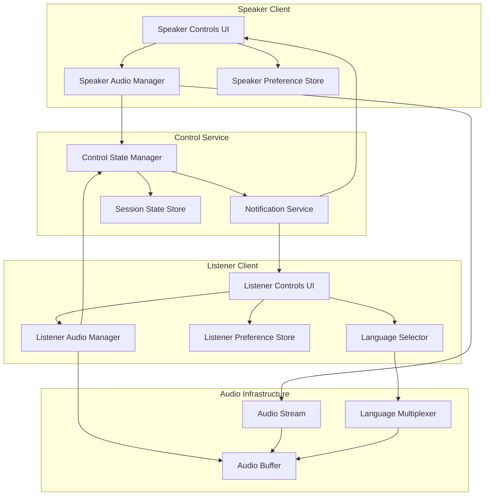

# Design Document: Speaker & Listener Controls

## Overview

The Speaker & Listener Controls system provides a comprehensive interface for managing audio communication in real-time sessions. The design focuses on low-latency control mechanisms, state synchronization, and user preference persistence. The system is built as a modular component that integrates with existing audio streaming infrastructure while maintaining independence for testing and reusability.

## Architecture

### High-Level Architecture



### Component Interaction Flow

1. **Control Initiation**: User interacts with UI controls (pause, mute, volume, language)
2. **Local State Update**: Audio Manager updates local state immediately for responsive UI
3. **State Propagation**: Control State Manager synchronizes state across clients
4. **Notification**: Notification Service broadcasts state changes to relevant parties
5. **Audio Processing**: Audio infrastructure applies the control changes to streams

## Components and Interfaces

### 1. Speaker Controls UI Component

**Responsibilities:**
- Render control interface for speakers
- Handle user input events
- Display current control states
- Show listener status information

**Interface:**

```typescript
interface SpeakerControlsProps {
  sessionId: string;
  onPauseToggle: () => void;
  onMuteToggle: () => void;
  onVolumeChange: (volume: number) => void;
  isPaused: boolean;
  isMuted: boolean;
  volume: number;
  listenerCount: number;
  listenerStates?: ListenerState[];
}

interface ListenerState {
  listenerId: string;
  displayName?: string;
  isPaused: boolean;
  isMuted: boolean;
}
```

### 2. Listener Controls UI Component

**Responsibilities:**
- Render control interface for listeners
- Handle user input events
- Display current control states
- Provide language selection interface

**Interface:**

```typescript
interface ListenerControlsProps {
  sessionId: string;
  onPauseToggle: () => void;
  onMuteToggle: () => void;
  onVolumeChange: (volume: number) => void;
  onLanguageChange: (languageCode: string) => void;
  isPaused: boolean;
  isMuted: boolean;
  volume: number;
  selectedLanguage: string;
  availableLanguages: Language[];
  speakerState: SpeakerState;
}

interface Language {
  code: string;
  name: string;
  isAvailable: boolean;
}

interface SpeakerState {
  isPaused: boolean;
  isMuted: boolean;
}
```

### 3. Audio Manager (Speaker & Listener)

**Responsibilities:**
- Manage audio stream state
- Apply control changes to audio processing
- Handle buffering for pause functionality
- Coordinate with Control State Manager

**Interface:**

```typescript
interface AudioManager {
  // Control methods
  pause(): Promise<void>;
  resume(): Promise<void>;
  mute(): Promise<void>;
  unmute(): Promise<void>;
  setVolume(volume: number): Promise<void>;
  
  // State queries
  getState(): AudioState;
  
  // Event handlers
  onStateChange(callback: (state: AudioState) => void): void;
  onBufferStatus(callback: (status: BufferStatus) => void): void;
}

interface AudioState {
  isPaused: boolean;
  isMuted: boolean;
  volume: number;
  timestamp: number;
}

interface BufferStatus {
  currentSize: number;
  maxSize: number;
  isOverflowing: boolean;
}
```

### 4. Control State Manager

**Responsibilities:**
- Maintain authoritative state for all controls
- Synchronize state across clients
- Validate state transitions
- Emit state change events

**Interface:**

```typescript
interface ControlStateManager {
  // Speaker controls
  updateSpeakerState(sessionId: string, userId: string, state: Partial<AudioState>): Promise<void>;
  getSpeakerState(sessionId: string, userId: string): Promise<AudioState>;
  
  // Listener controls
  updateListenerState(sessionId: string, userId: string, state: Partial<AudioState>): Promise<void>;
  getListenerState(sessionId: string, userId: string): Promise<AudioState>;
  
  // Session queries
  getSessionState(sessionId: string): Promise<SessionState>;
  getListenerStates(sessionId: string): Promise<Map<string, AudioState>>;
  
  // Event subscriptions
  subscribeToSpeakerState(sessionId: string, callback: (state: AudioState) => void): () => void;
  subscribeToListenerState(sessionId: string, userId: string, callback: (state: AudioState) => void): () => void;
}

interface SessionState {
  sessionId: string;
  speakerState: AudioState;
  listenerStates: Map<string, AudioState>;
  activeListenerCount: number;
}
```

### 5. Language Selector

**Responsibilities:**
- Manage available language streams
- Handle language switching via stream reconnection
- Coordinate with audio multiplexer
- Maintain language preference

**Language Switch Mechanism:**

The language switching is implemented using **Option A: Stream Reconnection**. When a listener switches languages:

1. Listener requests new language stream URL from Language Selector
2. Audio Manager pauses current stream and saves playback position
3. Audio Manager disconnects from current language stream
4. Audio Manager connects to new language stream URL
5. Audio Manager resumes playback from synchronized position
6. Total switch time target: <500ms

This approach provides:
- Clean separation between language streams
- Independent scaling per language
- Simpler server-side routing
- Better fault isolation

**Interface:**

```typescript
interface LanguageSelector {
  // Language management
  getAvailableLanguages(sessionId: string): Promise<Language[]>;
  switchLanguage(sessionId: string, languageCode: string): Promise<void>;
  getCurrentLanguage(sessionId: string): Promise<string>;
  
  // Stream coordination
  getLanguageStreamUrl(sessionId: string, languageCode: string): Promise<string>;
  
  // Switch coordination
  prepareLanguageSwitch(sessionId: string, fromLanguage: string, toLanguage: string): Promise<SwitchContext>;
  completeLanguageSwitch(sessionId: string, context: SwitchContext): Promise<void>;
  
  // Event handlers
  onLanguageChange(callback: (languageCode: string) => void): void;
  onLanguageAvailability(callback: (languages: Language[]) => void): void;
}

interface SwitchContext {
  fromLanguage: string;
  toLanguage: string;
  newStreamUrl: string;
  syncTimestamp: number;
  estimatedLatency: number;
}
```

### 6. Preference Store

**Responsibilities:**
- Persist user preferences locally
- Load preferences on session start
- Provide preference reset functionality

**Interface:**

```typescript
interface PreferenceStore {
  // Save preferences
  saveVolume(userId: string, volume: number): Promise<void>;
  saveLanguage(userId: string, languageCode: string): Promise<void>;
  saveKeyboardShortcuts(userId: string, shortcuts: KeyboardShortcuts): Promise<void>;
  
  // Load preferences
  getVolume(userId: string): Promise<number | null>;
  getLanguage(userId: string): Promise<string | null>;
  getKeyboardShortcuts(userId: string): Promise<KeyboardShortcuts | null>;
  
  // Reset
  resetPreferences(userId: string): Promise<void>;
}

interface KeyboardShortcuts {
  mute: string;
  pause: string;
  volumeUp: string;
  volumeDown: string;
}
```

### 7. Notification Service

**Responsibilities:**
- Broadcast state changes to relevant clients
- Handle real-time notifications
- Manage notification subscriptions

**Interface:**

```typescript
interface NotificationService {
  // Notify state changes
  notifySpeakerStateChange(sessionId: string, state: AudioState): Promise<void>;
  notifyListenerStateChange(sessionId: string, userId: string, state: AudioState): Promise<void>;
  notifyListenerJoined(sessionId: string, userId: string): Promise<void>;
  notifyListenerLeft(sessionId: string, userId: string): Promise<void>;
  
  // Subscribe to notifications
  subscribeToSession(sessionId: string, callback: (notification: Notification) => void): () => void;
}

interface Notification {
  type: 'speaker_state' | 'listener_state' | 'listener_joined' | 'listener_left';
  sessionId: string;
  userId?: string;
  data: any;
  timestamp: number;
}
```

## Data Models

### Control State Model

```typescript
interface ControlState {
  sessionId: string;
  userId: string;
  role: 'speaker' | 'listener';
  audioState: AudioState;
  languagePreference?: string;
  lastUpdated: number;
}

interface AudioState {
  isPaused: boolean;
  isMuted: boolean;
  volume: number; // 0-100
  timestamp: number;
}
```

### Session State Model

```typescript
interface SessionControlState {
  sessionId: string;
  speakerId: string;
  speakerState: AudioState;
  listeners: Map<string, ListenerControlState>;
  createdAt: number;
  updatedAt: number;
}

interface ListenerControlState {
  userId: string;
  audioState: AudioState;
  languagePreference: string;
  joinedAt: number;
  lastActiveAt: number;
}
```

### Preference Model

```typescript
interface UserPreferences {
  userId: string;
  volume: number;
  languagePreference: string;
  keyboardShortcuts: KeyboardShortcuts;
  autoResumeOnJoin: boolean;
  createdAt: number;
  updatedAt: number;
}
```

### Buffer State Model

```typescript
interface AudioBufferState {
  sessionId: string;
  userId: string;
  bufferSize: number; // in bytes
  maxBufferSize: number; // 30 seconds worth
  bufferedDuration: number; // in milliseconds
  isOverflowing: boolean;
  oldestTimestamp: number;
  newestTimestamp: number;
}
```

### Circular Audio Buffer Implementation

```typescript
class CircularAudioBuffer {
  private buffer: Float32Array;
  private writePos: number = 0;
  private readPos: number = 0;
  private maxDuration: number = 30000; // 30 seconds in milliseconds
  private sampleRate: number;
  private maxSamples: number;
  private availableSamples: number = 0;
  
  constructor(sampleRate: number, maxDurationMs: number = 30000) {
    this.sampleRate = sampleRate;
    this.maxDuration = maxDurationMs;
    this.maxSamples = Math.floor((sampleRate * maxDurationMs) / 1000);
    this.buffer = new Float32Array(this.maxSamples);
  }
  
  write(audioData: Float32Array): boolean {
    const samplesToWrite = audioData.length;
    
    // Check if buffer will overflow
    if (this.availableSamples + samplesToWrite > this.maxSamples) {
      // Discard oldest data to make room
      const overflow = (this.availableSamples + samplesToWrite) - this.maxSamples;
      this.readPos = (this.readPos + overflow) % this.maxSamples;
      this.availableSamples = this.maxSamples - samplesToWrite;
    }
    
    // Write new data
    for (let i = 0; i < samplesToWrite; i++) {
      this.buffer[this.writePos] = audioData[i];
      this.writePos = (this.writePos + 1) % this.maxSamples;
    }
    
    this.availableSamples += samplesToWrite;
    return this.availableSamples >= this.maxSamples * 0.9; // Return true if near capacity
  }
  
  read(durationMs: number): Float32Array {
    const samplesToRead = Math.min(
      Math.floor((this.sampleRate * durationMs) / 1000),
      this.availableSamples
    );
    
    const result = new Float32Array(samplesToRead);
    
    for (let i = 0; i < samplesToRead; i++) {
      result[i] = this.buffer[this.readPos];
      this.readPos = (this.readPos + 1) % this.maxSamples;
    }
    
    this.availableSamples -= samplesToRead;
    return result;
  }
  
  clear(): void {
    this.writePos = 0;
    this.readPos = 0;
    this.availableSamples = 0;
    this.buffer.fill(0);
  }
  
  getBufferedDuration(): number {
    return Math.floor((this.availableSamples / this.sampleRate) * 1000);
  }
  
  getBufferStatus(): BufferStatus {
    return {
      currentSize: this.availableSamples,
      maxSize: this.maxSamples,
      isOverflowing: this.availableSamples >= this.maxSamples * 0.9
    };
  }
}
```

## Error Handling

### Error Types

```typescript
enum ControlErrorType {
  STATE_SYNC_FAILED = 'STATE_SYNC_FAILED',
  AUDIO_CONTROL_FAILED = 'AUDIO_CONTROL_FAILED',
  LANGUAGE_SWITCH_FAILED = 'LANGUAGE_SWITCH_FAILED',
  PREFERENCE_SAVE_FAILED = 'PREFERENCE_SAVE_FAILED',
  BUFFER_OVERFLOW = 'BUFFER_OVERFLOW',
  INVALID_STATE_TRANSITION = 'INVALID_STATE_TRANSITION',
  SESSION_NOT_FOUND = 'SESSION_NOT_FOUND',
  UNAUTHORIZED = 'UNAUTHORIZED'
}

interface ControlError {
  type: ControlErrorType;
  message: string;
  sessionId?: string;
  userId?: string;
  timestamp: number;
  recoverable: boolean;
}
```

### Error Handling Strategies

1. **State Sync Failures**
   - Retry with exponential backoff (3 attempts)
   - Fall back to local state if sync fails
   - Display warning to user about potential desync
   - Log error for monitoring

2. **Audio Control Failures**
   - Revert UI state immediately
   - Display error message to user
   - Attempt recovery by re-initializing audio manager
   - Log error with audio context details

3. **Language Switch Failures**
   - Revert to previous language
   - Display error message with available languages
   - Check language availability before retry
   - Log error with language codes

4. **Buffer Overflow**
   - Discard oldest buffered data
   - Display warning about potential audio loss
   - Suggest resuming playback to user
   - Log buffer metrics

5. **Preference Save Failures**
   - Continue with in-memory preferences
   - Display warning about unsaved preferences
   - Retry save on next preference change
   - Log error with preference details

### Recovery Mechanisms

```typescript
interface RecoveryStrategy {
  // Automatic recovery
  retryWithBackoff(operation: () => Promise<void>, maxAttempts: number): Promise<void>;
  fallbackToLocalState(sessionId: string, userId: string): Promise<void>;
  reinitializeAudioManager(sessionId: string): Promise<void>;
  
  // User-initiated recovery
  manualSync(sessionId: string): Promise<void>;
  resetToDefaults(userId: string): Promise<void>;
  reconnectSession(sessionId: string): Promise<void>;
}
```

## Testing Strategy

### Unit Testing

**Components to Test:**
- Speaker Controls UI: Render states, event handlers, prop updates
- Listener Controls UI: Render states, language selector, event handlers
- Audio Manager: State transitions, volume calculations, buffer management
- Control State Manager: State synchronization, validation, event emission
- Language Selector: Language switching, stream coordination
- Preference Store: Save/load operations, reset functionality
- Notification Service: Message broadcasting, subscription management

**Test Approach:**
- Mock external dependencies (audio streams, storage, network)
- Test state transitions and edge cases
- Verify timing constraints (100ms for controls, 500ms for language switch)
- Test error handling and recovery

### Integration Testing

**Test Scenarios:**
1. **Speaker Control Flow**
   - Speaker pauses → listeners notified → audio stops
   - Speaker mutes → listeners see mute indicator → silence transmitted
   - Speaker adjusts volume → audio level changes → preference saved

2. **Listener Control Flow**
   - Listener pauses → buffer fills → resume → playback continues
   - Listener mutes → local audio stops → other listeners unaffected
   - Listener switches language → stream changes → preference saved

3. **Multi-User Scenarios**
   - Multiple listeners with different states
   - Listener joins with saved preferences
   - Speaker sees accurate listener count and states

4. **Error Scenarios**
   - Network interruption during state sync
   - Buffer overflow during extended pause
   - Language unavailable during switch attempt

### Performance Testing

**Metrics to Measure:**
- Control latency (target: <100ms for pause/mute, <500ms for language)
- State synchronization delay across clients
- Buffer memory usage during pause
- UI responsiveness under load
- Preference save/load times

**Load Testing:**
- 100+ concurrent listeners with varying control states
- Rapid control state changes (stress test)
- Extended pause periods with buffer management
- Frequent language switching

### End-to-End Testing

**User Flows:**
1. Speaker starts session → pauses → resumes → mutes → unmutes
2. Listener joins → adjusts volume → switches language → pauses → resumes
3. Listener saves preferences → leaves → rejoins → preferences applied
4. Speaker monitors listener states → sees accurate real-time updates
5. Keyboard shortcuts for all controls work correctly

**Acceptance Criteria Validation:**
- Verify all timing requirements from requirements document
- Confirm buffer capacity limits (30 seconds)
- Validate volume range (0-100)
- Test preference persistence across sessions
- Verify notification delivery to all relevant clients

## Performance Considerations

### Latency Optimization

1. **Immediate UI Feedback**
   - Update UI state synchronously before network calls
   - Use optimistic updates with rollback on failure
   - Debounce volume slider updates (50ms)

2. **State Synchronization**
   - Use WebSocket for real-time state updates
   - Batch multiple state changes within 100ms window
   - Implement delta updates instead of full state

3. **Audio Processing**
   - Apply mute/pause at audio processing level, not stream level
   - Use hardware-accelerated volume control when available
   - Pre-buffer language streams for faster switching

### Memory Management

1. **Buffer Management**
   - Implement circular buffer for pause functionality
   - Set hard limit at 30 seconds of audio data
   - Use efficient audio format (compressed)
   - Clear buffer on resume to free memory

2. **State Storage**
   - Use in-memory cache for active session states
   - Persist only essential preferences to storage
   - Implement LRU cache for listener states
   - Clean up stale session data periodically

### Scalability

1. **Client-Side**
   - Minimize re-renders with React.memo or similar
   - Use virtual scrolling for large listener lists
   - Throttle listener state updates (1 per second)

2. **Server-Side**
   - Implement pub/sub for state notifications
   - Use Redis for session state storage
   - Horizontal scaling for Control State Manager
   - Rate limiting on state update endpoints

## Security Considerations

1. **Authorization**
   - Verify user role before allowing control actions
   - Validate session membership before state updates
   - Implement rate limiting on control endpoints

2. **Data Privacy**
   - Store preferences locally when possible
   - Encrypt sensitive preference data
   - Don't expose listener identities without permission

3. **Input Validation**
   - Validate volume range (0-100)
   - Sanitize language codes
   - Verify session IDs format
   - Prevent injection attacks in keyboard shortcuts

## Deployment Considerations

1. **Feature Flags**
   - Enable/disable keyboard shortcuts
   - Toggle listener state visibility
   - Control buffer size limits
   - Enable/disable preference persistence

2. **Monitoring**
   - Track control latency metrics
   - Monitor buffer overflow events
   - Alert on state sync failures
   - Track language switch success rate

3. **Rollout Strategy**
   - Phase 1: Basic pause/mute controls
   - Phase 2: Volume control and preferences
   - Phase 3: Language switching
   - Phase 4: Keyboard shortcuts and advanced features
