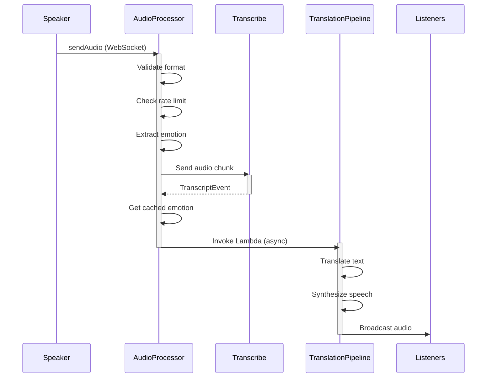
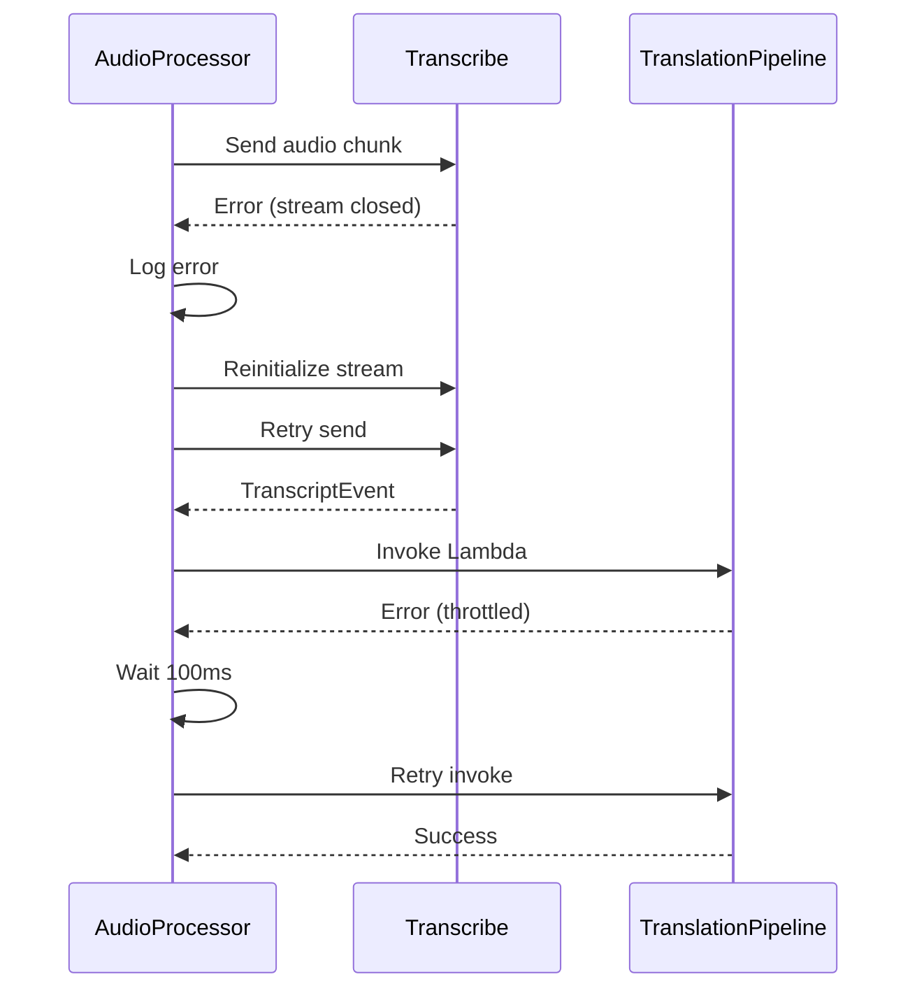
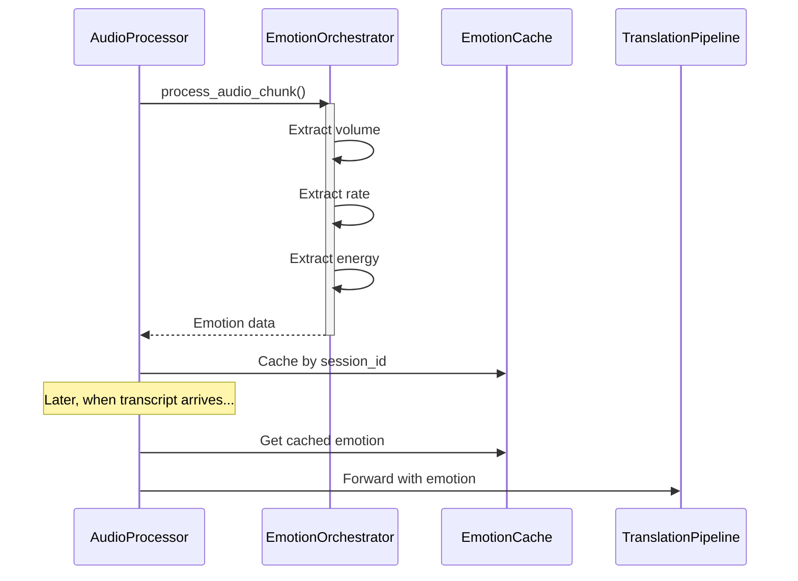

# WebSocket Audio Integration Points

## Overview

This document describes all integration points in the WebSocket Audio Integration system, including data flow, error handling, and retry logic.

## Integration Architecture

```
┌─────────────────────────────────────────────────────────────────────┐
│                     WebSocket Audio Integration                      │
├─────────────────────────────────────────────────────────────────────┤
│                                                                       │
│  Speaker Client                                                       │
│       │                                                               │
│       │ 1. WebSocket Connection (sendAudio route)                    │
│       ▼                                                               │
│  ┌──────────────────────────────────────────────────────┐           │
│  │         Audio Processor Lambda                        │           │
│  │  - Validates audio format                            │           │
│  │  - Enforces rate limiting                            │           │
│  │  - Extracts emotion dynamics (optional)              │           │
│  └──────────────────────────────────────────────────────┘           │
│       │                                                               │
│       │ 2. Audio Stream                                              │
│       ▼                                                               │
│  ┌──────────────────────────────────────────────────────┐           │
│  │    TranscribeStreamHandler                           │           │
│  │  - Manages Transcribe Streaming connection           │           │
│  │  - Buffers audio chunks                              │           │
│  │  - Processes transcript events                       │           │
│  └──────────────────────────────────────────────────────┘           │
│       │                                                               │
│       │ 3. Transcribe Streaming API                                  │
│       ▼                                                               │
│  ┌──────────────────────────────────────────────────────┐           │
│  │    AWS Transcribe Streaming                          │           │
│  │  - Real-time speech-to-text                          │           │
│  │  - Partial results with stability scores             │           │
│  │  - Multiple language support                         │           │
│  └──────────────────────────────────────────────────────┘           │
│       │                                                               │
│       │ 4. Transcript Events                                         │
│       ▼                                                               │
│  ┌──────────────────────────────────────────────────────┐           │
│  │    LambdaTranslationPipeline                         │           │
│  │  - Forwards transcripts to Translation Pipeline      │           │
│  │  - Includes emotion dynamics                         │           │
│  │  - Retry logic with exponential backoff              │           │
│  └──────────────────────────────────────────────────────┘           │
│       │                                                               │
│       │ 5. Lambda Invocation (async)                                 │
│       ▼                                                               │
│  ┌──────────────────────────────────────────────────────┐           │
│  │    Translation Pipeline Lambda                        │           │
│  │  - Translates to target languages                    │           │
│  │  - Synthesizes speech with emotion                   │           │
│  │  - Broadcasts to listeners                           │           │
│  └──────────────────────────────────────────────────────┘           │
│       │                                                               │
│       │ 6. WebSocket Messages                                        │
│       ▼                                                               │
│  Listener Clients                                                    │
│                                                                       │
└─────────────────────────────────────────────────────────────────────┘
```

## Integration Point 1: Audio Processor → Transcribe

### Description

The Audio Processor Lambda receives audio chunks via WebSocket and forwards them to AWS Transcribe Streaming API through the TranscribeStreamHandler.

### Data Flow

```
WebSocket Message (sendAudio)
    │
    ├─> Parse audio data from base64
    │
    ├─> Validate audio format (PCM, 16kHz, mono)
    │
    ├─> Check rate limits (max chunks per second)
    │
    ├─> Extract emotion dynamics (optional)
    │   └─> Cache emotion data by session_id
    │
    └─> Forward to TranscribeStreamHandler
        └─> Send to Transcribe stream
```

### Message Format

**Input (WebSocket)**:
```json
{
  "action": "sendAudio",
  "sessionId": "golden-eagle-427",
  "audioData": "base64_encoded_pcm_audio",
  "timestamp": 1699500000000
}
```

**Audio Specifications**:
- Format: PCM (16-bit signed integer)
- Sample Rate: 16000 Hz
- Channels: 1 (mono)
- Chunk Size: 3200 bytes (100ms at 16kHz)

### Error Handling

**Validation Errors**:
```python
# Invalid audio format
if not audio_format_validator.validate(audio_data):
    return {
        'statusCode': 400,
        'body': json.dumps({
            'type': 'error',
            'code': 'INVALID_AUDIO_FORMAT',
            'message': 'Audio must be PCM 16kHz mono'
        })
    }

# Rate limit exceeded
if not rate_limiter.check_rate(session_id):
    return {
        'statusCode': 429,
        'body': json.dumps({
            'type': 'error',
            'code': 'RATE_LIMIT_EXCEEDED',
            'message': 'Too many audio chunks. Max 10 per second.'
        })
    }
```

**Stream Errors**:
```python
try:
    await handler.send_audio_chunk(audio_data)
except RuntimeError as e:
    logger.error(f"Transcribe stream not initialized: {e}")
    # Attempt to reinitialize stream
    await handler.initialize_stream()
    await handler.send_audio_chunk(audio_data)
```

### Performance Characteristics

- **Latency**: <20ms from WebSocket receipt to Transcribe stream send
- **Throughput**: 10 chunks/second per session
- **Buffer Size**: 5 seconds of audio (80KB)
- **Memory**: ~100MB per active session

### Monitoring

**CloudWatch Metrics**:
- `AudioChunksReceived` - Count of audio chunks received
- `AudioProcessingLatency` - Time from receipt to Transcribe send
- `AudioBufferSize` - Current buffer size in bytes
- `AudioValidationErrors` - Count of validation failures

**CloudWatch Logs**:
```python
logger.debug(
    "Audio chunk processed",
    extra={
        'session_id': session_id,
        'chunk_size': len(audio_data),
        'buffer_size': handler.audio_buffer.size(),
        'duration_ms': duration_ms
    }
)
```

## Integration Point 2: Transcribe → Translation Pipeline

### Description

The TranscribeStreamHandler processes transcript events from AWS Transcribe and forwards them to the Translation Pipeline Lambda via LambdaTranslationPipeline client.

### Data Flow

```
Transcribe TranscriptEvent
    │
    ├─> Extract transcript text
    │
    ├─> Get stability score
    │
    ├─> Determine if partial or final
    │
    ├─> Retrieve cached emotion data
    │
    └─> Forward to Translation Pipeline
        │
        ├─> Construct payload with all fields
        │
        ├─> Invoke Lambda asynchronously
        │
        └─> Retry on failure (max 2 retries)
```

### Message Format

**Input (Transcribe Event)**:
```python
{
    'transcript': {
        'results': [{
            'alternatives': [{
                'transcript': 'Hello everyone',
                'stability_score': 0.95
            }],
            'is_partial': False,
            'result_id': 'result-123'
        }]
    }
}
```

**Output (Translation Pipeline Payload)**:
```json
{
  "sessionId": "golden-eagle-427",
  "sourceLanguage": "en",
  "transcriptText": "Hello everyone",
  "isPartial": false,
  "stabilityScore": 0.95,
  "timestamp": 1699500000000,
  "emotionDynamics": {
    "volume": 0.7,
    "rate": 1.2,
    "energy": 0.8
  }
}
```

### Error Handling

**Transcribe Stream Errors**:
```python
async def _process_events(self):
    try:
        async for event in self.stream.output_stream:
            if isinstance(event, TranscriptEvent):
                await self._handle_transcript_event(event)
    except Exception as e:
        logger.error(
            f"Error in Transcribe event loop: {e}",
            extra={'session_id': self.session_id}
        )
        # Attempt reconnection
        await self._reconnect()
```

**Translation Pipeline Invocation Errors**:
```python
def process(self, text, session_id, ...):
    for attempt in range(self.max_retries + 1):
        try:
            response = self.lambda_client.invoke(
                FunctionName=self.function_name,
                InvocationType='Event',
                Payload=json.dumps(payload)
            )
            if response['StatusCode'] in [200, 202]:
                return True
        except ClientError as e:
            if attempt < self.max_retries:
                time.sleep(self.retry_delay_ms / 1000)
                continue
            else:
                logger.error(
                    f"Failed to invoke Translation Pipeline",
                    extra={
                        'session_id': session_id,
                        'error': str(e),
                        'attempts': attempt + 1
                    }
                )
                return False
    return False
```

### Retry Logic

**Configuration**:
- Max Retries: 2
- Retry Delay: 100ms
- Backoff: Linear (no exponential backoff)

**Retry Decision**:
```python
# Retry on transient errors
if e.response['Error']['Code'] in ['ServiceUnavailable', 'TooManyRequestsException']:
    # Retry
    continue
else:
    # Don't retry on client errors
    return False
```

### Performance Characteristics

- **Latency**: <100ms from Transcribe event to Translation Pipeline invocation
- **Throughput**: 5 transcripts/second per session
- **Retry Overhead**: 200ms maximum (2 retries × 100ms)
- **Success Rate**: >99% (with retries)

### Monitoring

**CloudWatch Metrics**:
- `TranscriptionForwardingLatency` - Time from event to invocation
- `TranslationPipelineInvocations` - Count of successful invocations
- `TranslationPipelineErrors` - Count of failed invocations
- `TranscriptionRetries` - Count of retry attempts

**CloudWatch Logs**:
```python
logger.debug(
    "Transcript forwarded to Translation Pipeline",
    extra={
        'session_id': session_id,
        'text_length': len(text),
        'is_partial': is_partial,
        'stability_score': stability_score,
        'has_emotion': emotion_data is not None
    }
)
```

## Integration Point 3: Emotion Detection Integration

### Description

The Audio Processor optionally extracts emotion dynamics from audio chunks using the EmotionDynamicsOrchestrator and caches them for correlation with transcripts.

### Data Flow

```
Audio Chunk
    │
    ├─> Convert bytes to numpy array
    │
    ├─> Extract emotion dynamics
    │   ├─> Volume (RMS energy)
    │   ├─> Speaking rate (onset detection)
    │   └─> Energy (spectral features)
    │
    ├─> Cache by session_id
    │
    └─> Include in Translation Pipeline payload
```

### Emotion Data Format

**Cached Emotion Data**:
```python
{
    'session_id': {
        'volume': 0.7,      # 0.0-1.0 (quiet to loud)
        'rate': 1.2,        # 0.5-2.0 (slow to fast)
        'energy': 0.8,      # 0.0-1.0 (low to high)
        'timestamp': 1699500000000
    }
}
```

**Default Values** (on extraction failure):
```python
{
    'volume': 0.5,  # Neutral
    'rate': 1.0,    # Normal
    'energy': 0.5   # Neutral
}
```

### Error Handling

**Extraction Errors**:
```python
try:
    audio_array = np.frombuffer(audio_data, dtype=np.int16)
    emotion_data = emotion_orchestrator.process_audio_chunk(
        audio_array,
        sample_rate=16000
    )
    emotion_cache[session_id] = emotion_data
except Exception as e:
    logger.error(
        f"Error extracting emotion dynamics: {e}",
        extra={'session_id': session_id}
    )
    # Use default neutral values
    emotion_cache[session_id] = {
        'volume': 0.5,
        'rate': 1.0,
        'energy': 0.5
    }
    # Emit metric
    metrics_emitter.emit_metric(
        'EmotionExtractionErrors',
        1,
        'Count'
    )
```

### Performance Characteristics

- **Latency**: <50ms per audio chunk
- **Memory**: ~50MB for librosa + numpy
- **CPU**: ~5% of Lambda execution time
- **Cache Size**: ~1KB per session

### Monitoring

**CloudWatch Metrics**:
- `EmotionExtractionLatency` - Time to extract emotion
- `EmotionExtractionErrors` - Count of extraction failures
- `EmotionCacheSize` - Number of cached sessions

## Sequence Diagrams

### Complete Audio-to-Translation Flow



### Error Handling Flow



### Emotion Detection Flow



## Configuration

### Environment Variables

**Audio Processor Lambda**:
```bash
TRANSLATION_PIPELINE_FUNCTION_NAME=TranslationProcessor
ENABLE_EMOTION_DETECTION=true
EMOTION_CACHE_TTL_SECONDS=60
MAX_AUDIO_CHUNKS_PER_SECOND=10
AUDIO_BUFFER_MAX_SECONDS=5
```

**TranscribeStreamHandler**:
```python
# Configured in code
source_language = 'en'
media_sample_rate_hz = 16000
media_encoding = 'pcm'
enable_partial_results_stabilization = True
partial_results_stability = 'high'
```

**LambdaTranslationPipeline**:
```python
# Configured in code
max_retries = 2
retry_delay_ms = 100
```

### IAM Permissions

**Audio Processor Lambda**:
```json
{
  "Version": "2012-10-17",
  "Statement": [
    {
      "Effect": "Allow",
      "Action": [
        "transcribe:StartStreamTranscription"
      ],
      "Resource": "*"
    },
    {
      "Effect": "Allow",
      "Action": [
        "lambda:InvokeFunction"
      ],
      "Resource": "arn:aws:lambda:*:*:function:TranslationProcessor"
    },
    {
      "Effect": "Allow",
      "Action": [
        "logs:CreateLogGroup",
        "logs:CreateLogStream",
        "logs:PutLogEvents"
      ],
      "Resource": "*"
    },
    {
      "Effect": "Allow",
      "Action": [
        "cloudwatch:PutMetricData"
      ],
      "Resource": "*"
    }
  ]
}
```

## Testing Integration Points

### Unit Tests

**Audio Processor → Transcribe**:
```python
@pytest.mark.asyncio
async def test_audio_forwarding_to_transcribe():
    handler = TranscribeStreamHandler('test-123', 'en', mock_pipeline)
    await handler.initialize_stream()
    
    audio_data = generate_test_audio()
    await handler.send_audio_chunk(audio_data)
    
    # Verify audio sent to stream
    assert handler.stream.input_stream.send_audio_event.called
```

**Transcribe → Translation Pipeline**:
```python
@mock_lambda
def test_transcript_forwarding():
    pipeline = LambdaTranslationPipeline('test-function')
    
    result = pipeline.process(
        text='Hello',
        session_id='test-123',
        source_language='en'
    )
    
    assert result is True
    # Verify Lambda invoked with correct payload
```

### Integration Tests

**End-to-End Flow**:
```python
@pytest.mark.integration
async def test_complete_audio_to_translation_flow():
    # Send audio via WebSocket
    # Verify Transcribe stream initialized
    # Verify transcript generated
    # Verify forwarded to Translation Pipeline
    # Verify emotion data included
    pass
```

## Troubleshooting

See [TROUBLESHOOTING.md](./TROUBLESHOOTING.md) for detailed troubleshooting guide.

## References

- [AWS Transcribe Streaming API](https://docs.aws.amazon.com/transcribe/latest/dg/streaming.html)
- [AWS Lambda Invoke API](https://docs.aws.amazon.com/lambda/latest/dg/API_Invoke.html)
- [Emotion Dynamics Documentation](../emotion_dynamics/README.md)
- [Translation Pipeline Documentation](../../translation-pipeline/README.md)
